# Design Modelling

## UML Models Overview
This document provides comprehensive visual models for the Unified Patient Access & Clinical Intelligence Platform. The UML diagrams translate requirements from [spec.md](.propel/context/docs/spec.md) and architectural decisions from [design.md](.propel/context/docs/design.md) into visual representations. The models include:

- **Architectural Views**: System context, component architecture, deployment, data flow, and entity-relationship diagrams that illustrate the high-level structure and design decisions
- **Sequence Diagrams**: One diagram for each of the 12 use cases (UC-001 through UC-012), detailing actor interactions, system component message flows, and data operations

These diagrams serve as the bridge between textual requirements and implementation, providing developers, stakeholders, and architects with a shared visual understanding of the platform's structure and behavior.

## Architectural Views

### System Context Diagram
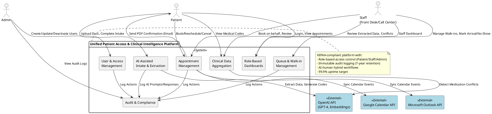
```plantuml
@startuml
!define RECTANGLE(x) rectangle x as x
skinparam rectangleBackgroundColor<<External>> LightBlue
skinparam rectangleBackgroundColor<<System>> LightGreen

' External Actors
actor "Patient" as patient
actor "Staff\n(Front Desk/Call Center)" as staff
actor "Admin" as admin

' External Systems
rectangle "Google Calendar API" as google <<External>>
rectangle "Microsoft Outlook API" as outlook <<External>>
rectangle "OpenAI API\n(GPT-4, Embeddings)" as openai <<External>>

' Main System Boundary
package "Unified Patient Access & Clinical Intelligence Platform" as system <<System>> {
  rectangle "Role-Based\nDashboards" as dashboards
  rectangle "Appointment\nManagement" as appointments
  rectangle "AI-Assisted\nIntake & Extraction" as ai_features
  rectangle "Queue & Walk-in\nManagement" as queue
  rectangle "Clinical Data\nAggregation" as clinical
  rectangle "User & Access\nManagement" as user_mgmt
  rectangle "Audit & Compliance" as audit
}

' Patient Interactions
patient --> dashboards : Login, View Appointments
patient --> appointments : Book/Reschedule/Cancel
patient --> ai_features : Upload Docs, Complete Intake
patient --> clinical : View Medical Codes

' Staff Interactions
staff --> dashboards : Staff Dashboard
staff --> appointments : Book on behalf, Review
staff --> queue : Manage Walk-ins, Mark Arrival/No-Show
staff --> clinical : Review Extracted Data, Conflicts

' Admin Interactions
admin --> user_mgmt : Create/Update/Deactivate Users
admin --> audit : View Audit Logs

' System to External Services
appointments --> google : Sync Calendar Events
appointments --> outlook : Sync Calendar Events
appointments --> patient : Send PDF Confirmation (Email)
ai_features --> openai : Extract Data, Generate Codes
clinical --> openai : Detect Medication Conflicts

' Audit Logging
appointments --> audit : Log Actions
queue --> audit : Log Actions
user_mgmt --> audit : Log Actions
ai_features --> audit : Log AI Prompts/Responses

note right of system
  HIPAA-compliant platform with:
  - Role-based access control (Patient/Staff/Admin)
  - Immutable audit logging (7-year retention)
  - AI-human hybrid workflows
  - 99.9% uptime target
end note

@enduml
```

### Component Architecture Diagram
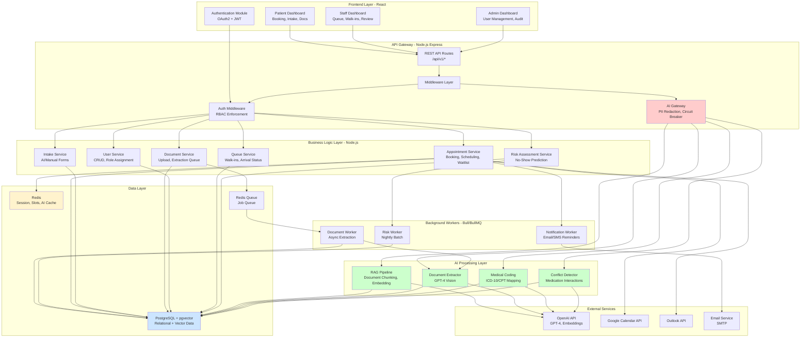
```mermaid
graph TB
    subgraph "Frontend Layer - React"
        FE_AUTH[Authentication Module<br/>OAuth2 + JWT]
        FE_PATIENT[Patient Dashboard<br/>Booking, Intake, Docs]
        FE_STAFF[Staff Dashboard<br/>Queue, Walk-ins, Review]
        FE_ADMIN[Admin Dashboard<br/>User Management, Audit]
    end

    subgraph "API Gateway - Node.js Express"
        API_ROUTES[REST API Routes<br/>/api/v1/*]
        API_MIDDLEWARE[Middleware Layer]
        API_AUTH[Auth Middleware<br/>RBAC Enforcement]
        API_AIGW[AI Gateway<br/>PII Redaction, Circuit Breaker]
    end

    subgraph "Business Logic Layer - Node.js"
        BL_APPT[Appointment Service<br/>Booking, Scheduling, Waitlist]
        BL_INTAKE[Intake Service<br/>AI/Manual Forms]
        BL_DOCS[Document Service<br/>Upload, Extraction Queue]
        BL_USER[User Service<br/>CRUD, Role Assignment]
        BL_QUEUE[Queue Service<br/>Walk-ins, Arrival Status]
        BL_RISK[Risk Assessment Service<br/>No-Show Prediction]
    end

    subgraph "AI Processing Layer"
        AI_RAG[RAG Pipeline<br/>Document Chunking, Embedding]
        AI_EXTRACT[Document Extractor<br/>GPT-4 Vision]
        AI_CODING[Medical Coding<br/>ICD-10/CPT Mapping]
        AI_CONFLICT[Conflict Detector<br/>Medication Interactions]
    end

    subgraph "Background Workers - Bull/BullMQ"
        WORKER_DOC[Document Worker<br/>Async Extraction]
        WORKER_RISK[Risk Worker<br/>Nightly Batch]
        WORKER_NOTIFY[Notification Worker<br/>Email/SMS Reminders]
    end

    subgraph "Data Layer"
        CACHE[Redis<br/>Session, Slots, AI Cache]
        DB[PostgreSQL + pgvector<br/>Relational + Vector Data]
        QUEUE_BUS[Redis Queue<br/>Job Queue]
    end

    subgraph "External Services"
        EXT_OPENAI[OpenAI API<br/>GPT-4, Embeddings]
        EXT_CAL_G[Google Calendar API]
        EXT_CAL_O[Outlook API]
        EXT_EMAIL[Email Service<br/>SMTP]
    end

    FE_AUTH --> API_AUTH
    FE_PATIENT --> API_ROUTES
    FE_STAFF --> API_ROUTES
    FE_ADMIN --> API_ROUTES

    API_ROUTES --> API_MIDDLEWARE
    API_MIDDLEWARE --> API_AUTH
    API_MIDDLEWARE --> API_AIGW

    API_AUTH --> BL_APPT
    API_AUTH --> BL_INTAKE
    API_AUTH --> BL_DOCS
    API_AUTH --> BL_USER
    API_AUTH --> BL_QUEUE
    API_AUTH --> BL_RISK

    API_AIGW --> AI_RAG
    API_AIGW --> AI_EXTRACT
    API_AIGW --> AI_CODING
    API_AIGW --> AI_CONFLICT

    BL_DOCS --> QUEUE_BUS
    QUEUE_BUS --> WORKER_DOC
    WORKER_DOC --> AI_EXTRACT
    WORKER_DOC --> DB

    BL_RISK --> WORKER_RISK
    WORKER_RISK --> DB

    BL_APPT --> WORKER_NOTIFY
    WORKER_NOTIFY --> EXT_EMAIL

    AI_RAG --> EXT_OPENAI
    AI_EXTRACT --> EXT_OPENAI
    AI_CODING --> EXT_OPENAI
    AI_CONFLICT --> EXT_OPENAI

    BL_APPT --> EXT_CAL_G
    BL_APPT --> EXT_CAL_O

    BL_APPT --> CACHE
    BL_APPT --> DB
    BL_INTAKE --> DB
    BL_DOCS --> DB
    BL_USER --> DB
    BL_QUEUE --> DB
    BL_RISK --> DB

    AI_RAG --> DB
    AI_EXTRACT --> DB
    AI_CODING --> DB
    AI_CONFLICT --> DB

    style API_AIGW fill:#ffcccc
    style AI_RAG fill:#ccffcc
    style AI_EXTRACT fill:#ccffcc
    style AI_CODING fill:#ccffcc
    style AI_CONFLICT fill:#ccffcc
    style CACHE fill:#fff3cd
    style DB fill:#cce5ff
```

### Deployment Architecture Diagram
```plantuml
@startuml
!define AzurePuml https://raw.githubusercontent.com/plantuml-stdlib/Azure-PlantUML/release/2-2/dist
!includeurl AzurePuml/AzureCommon.puml
!includeurl AzurePuml/Compute/AzureVirtualMachine.puml
!includeurl AzurePuml/Databases/AzurePostgreSQL.puml
!includeurl AzurePuml/Storage/AzureStorage.puml
!includeurl AzurePuml/Web/AzureWebApp.puml

skinparam linetype ortho

title Deployment Architecture - Free/Open-Source Hosting

' Users/Clients
actor "Patients" as patient
actor "Staff" as staff
actor "Admin" as admin

' Frontend/CDN
package "Netlify (Free Tier)" as netlify {
  [React Frontend\n(Static Build)] as frontend
  note right: SSL auto-provisioned\nGlobal CDN\nRole-based routing
}

' Backend Infrastructure
package "Windows Server (Self-Hosted or GitHub Codespaces)" as backend_infra {
  
  package "IIS Reverse Proxy" as iis {
    [IIS\n(URL Rewrite)] as iis_proxy
    note right: SSL Termination\n(Let's Encrypt)\nForwards to Node.js
  }
  
  package "Node.js Backend (Windows Service)" as node_service {
    [PM2 Cluster\n(Express API)] as api
    note right: Runs as Windows Service\nCluster mode for HA\nPort 3000
  }
  
  package "Database Services" as db_services {
    database "PostgreSQL 15\n+ pgvector" as postgres {
      [Structured Data\n(Patients, Appts)] as db_main
      [Vector Embeddings\n(768-dim)] as db_vector
    }
    note bottom: Daily pg_dump backups\nTLS connections only\nField-level PII encryption
  }
  
  package "Background Workers" as workers {
    [Bull Worker Pool\n(Document Processing)] as worker_doc
    [Bull Worker\n(Risk Assessment)] as worker_risk
    [Bull Worker\n(Notifications)] as worker_notify
  }
}

' Caching Layer
cloud "Upstash Redis (Free Tier)" as redis {
  [Session Cache] as cache_session
  [Slot Availability Cache] as cache_slots
  [AI Response Cache] as cache_ai
  [Job Queue] as queue_jobs
  note bottom: 10K commands/day\nManaged service\nNo infrastructure cost
}

' External Services
cloud "OpenAI API" as openai {
  [GPT-4 Inference] as gpt4
  [text-embedding-ada-002] as embeddings
  note bottom: Pay-per-use\n~$200-500/month\nNo subscription required
}

cloud "Calendar APIs" as calendars {
  [Google Calendar API] as gcal
  [Microsoft Outlook API] as outlook
  note bottom: Free tier APIs\nOAuth2 PKCE flow
}

cloud "Email Service" as email_service {
  [SMTP Provider\n(Free tier)] as smtp
  note bottom: SendGrid/Mailgun\nFree tier: 100/day
}

' Monitoring
package "Monitoring Stack (Self-Hosted)" as monitoring {
  [Prometheus\n(Metrics Collector)] as prometheus
  [Grafana\n(Dashboards)] as grafana
  note bottom: Open-source monitoring\nAlerts on 99.9% uptime breach
}

' Relationships
patient --> frontend : HTTPS
staff --> frontend : HTTPS
admin --> frontend : HTTPS

frontend --> iis_proxy : HTTPS (443)
iis_proxy --> api : HTTP (3000)

api --> postgres : TLS (5432)
api --> redis : TLS (6380)
api --> openai : HTTPS (API Key)
api --> calendars : HTTPS (OAuth2)
api --> email_service : SMTP/TLS

worker_doc --> postgres : TLS
worker_doc --> redis : Read Queue
worker_doc --> openai : Document Extraction

worker_risk --> postgres : Batch Queries
worker_notify --> email_service : Send Emails

prometheus --> api : Scrape Metrics
grafana --> prometheus : Query Metrics

note right of backend_infra
  **Deployment Constraints (NFR-006, NFR-007):**
  - Windows Services/IIS mandatory
  - No AWS/Azure paid services
  - Self-hosted PostgreSQL
  - Free-tier external services only
end note

@enduml
```

### Data Flow Diagram
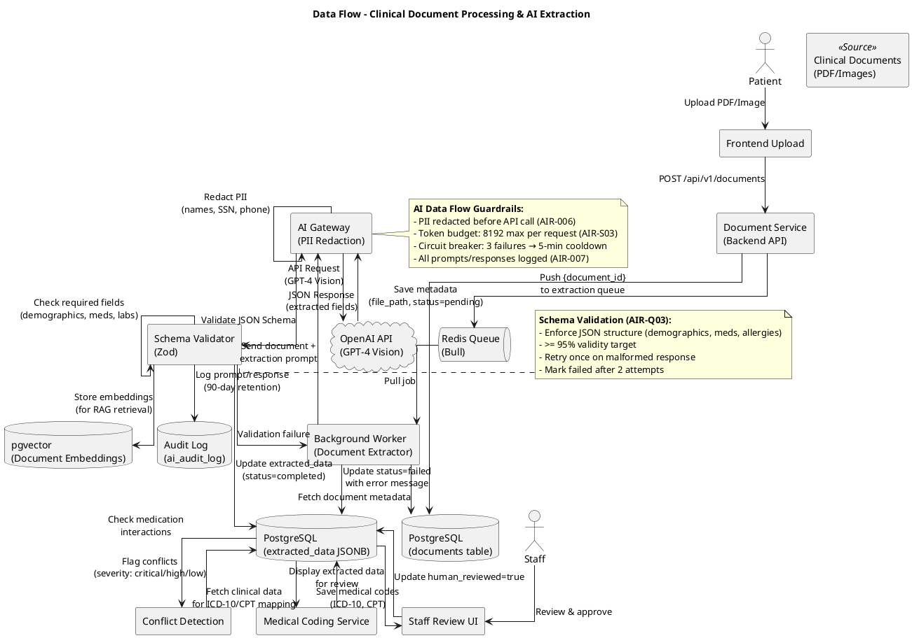
```plantuml
@startuml
skinparam linetype ortho

title Data Flow - Clinical Document Processing & AI Extraction

' External Actors
actor "Patient" as patient
actor "Staff" as staff

' Data Sources
rectangle "Clinical Documents\n(PDF/Images)" as docs <<Source>>

' Processing Components
rectangle "Frontend Upload" as upload
rectangle "Document Service\n(Backend API)" as doc_service
database "PostgreSQL\n(documents table)" as db_docs
queue "Redis Queue\n(Bull)" as redis_queue
rectangle "Background Worker\n(Document Extractor)" as worker_extract

' AI Processing
rectangle "AI Gateway\n(PII Redaction)" as ai_gateway
cloud "OpenAI API\n(GPT-4 Vision)" as openai_api
rectangle "Schema Validator\n(Zod)" as validator

' Data Stores
database "PostgreSQL\n(extracted_data JSONB)" as db_extracted
database "pgvector\n(Document Embeddings)" as db_vectors
database "Audit Log\n(ai_audit_log)" as db_audit

' Output/Consumption
rectangle "Staff Review UI" as staff_ui
rectangle "Medical Coding Service" as coding_service
rectangle "Conflict Detection" as conflict_service

' Data Flow: Upload
patient --> upload : Upload PDF/Image
upload --> doc_service : POST /api/v1/documents
doc_service --> db_docs : Save metadata\n(file_path, status=pending)
doc_service --> redis_queue : Push {document_id}\nto extraction queue

' Data Flow: Async Extraction
redis_queue --> worker_extract : Pull job
worker_extract --> db_docs : Fetch document metadata
worker_extract --> ai_gateway : Send document +\nextraction prompt
ai_gateway --> ai_gateway : Redact PII\n(names, SSN, phone)
ai_gateway --> openai_api : API Request\n(GPT-4 Vision)
openai_api --> ai_gateway : JSON Response\n(extracted fields)

' Data Flow: Validation & Storage
ai_gateway --> validator : Validate JSON Schema
validator --> validator : Check required fields\n(demographics, meds, labs)
validator --> db_extracted : Update extracted_data\n(status=completed)
validator --> db_vectors : Store embeddings\n(for RAG retrieval)
validator --> db_audit : Log prompt/response\n(90-day retention)

' Data Flow: Error Handling
validator --> worker_extract : Validation failure
worker_extract --> db_extracted : Update status=failed\nwith error message

' Data Flow: Consumption
db_extracted --> staff_ui : Display extracted data\nfor review
staff --> staff_ui : Review & approve
staff_ui --> db_extracted : Update human_reviewed=true

db_extracted --> coding_service : Fetch clinical data\nfor ICD-10/CPT mapping
db_extracted --> conflict_service : Check medication\ninteractions

coding_service --> db_extracted : Save medical codes\n(ICD-10, CPT)
conflict_service --> db_extracted : Flag conflicts\n(severity: critical/high/low)

note right of ai_gateway
  **AI Data Flow Guardrails:**
  - PII redacted before API call (AIR-006)
  - Token budget: 8192 max per request (AIR-S03)
  - Circuit breaker: 3 failures → 5-min cooldown
  - All prompts/responses logged (AIR-007)
end note

note left of validator
  **Schema Validation (AIR-Q03):**
  - Enforce JSON structure (demographics, meds, allergies)
  - >= 95% validity target
  - Retry once on malformed response
  - Mark failed after 2 attempts
end note

@enduml
```

### Logical Data Model (ERD)
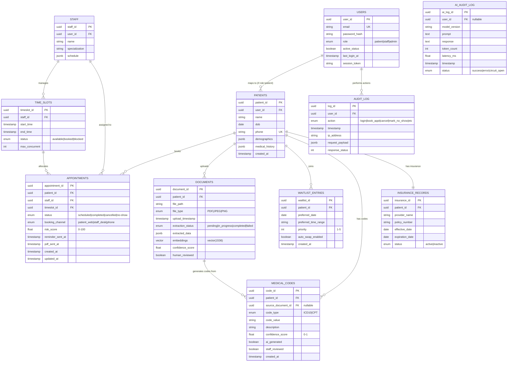
```mermaid
erDiagram
    USERS ||--o{ PATIENTS : "maps to (if role=patient)"
    USERS ||--o{ AUDIT_LOG : "performs actions"
    USERS {
        uuid user_id PK
        string email UK
        string password_hash
        enum role "patient|staff|admin"
        boolean active_status
        timestamp last_login_at
        string session_token
    }

    PATIENTS ||--o{ APPOINTMENTS : "books"
    PATIENTS ||--o{ DOCUMENTS : "uploads"
    PATIENTS ||--o{ WAITLIST_ENTRIES : "joins"
    PATIENTS ||--o{ MEDICAL_CODES : "has codes"
    PATIENTS ||--|| INSURANCE_RECORDS : "has insurance"
    PATIENTS {
        uuid patient_id PK
        uuid user_id FK
        string name
        date dob
        string phone UK
        jsonb demographics
        jsonb medical_history
        timestamp created_at
    }

    STAFF ||--o{ TIME_SLOTS : "manages"
    STAFF ||--o{ APPOINTMENTS : "assigned to"
    STAFF {
        uuid staff_id PK
        uuid user_id FK
        string name
        string specialization
        jsonb schedule
    }

    TIME_SLOTS ||--o{ APPOINTMENTS : "allocates"
    TIME_SLOTS {
        uuid timeslot_id PK
        uuid staff_id FK
        timestamp start_time
        timestamp end_time
        enum status "available|booked|blocked"
        int max_concurrent
    }

    APPOINTMENTS {
        uuid appointment_id PK
        uuid patient_id FK
        uuid staff_id FK
        uuid timeslot_id FK
        enum status "scheduled|completed|cancelled|no-show"
        enum booking_channel "patient_web|staff_desk|phone"
        float risk_score "0-100"
        timestamp reminder_sent_at
        timestamp pdf_sent_at
        timestamp created_at
        timestamp updated_at
    }

    WAITLIST_ENTRIES {
        uuid waitlist_id PK
        uuid patient_id FK
        date preferred_date
        string preferred_time_range
        int priority "1-5"
        boolean auto_swap_enabled
        timestamp created_at
    }

    DOCUMENTS ||--o{ MEDICAL_CODES : "generates codes from"
    DOCUMENTS {
        uuid document_id PK
        uuid patient_id FK
        string file_path
        enum file_type "PDF|JPEG|PNG"
        timestamp upload_timestamp
        enum extraction_status "pending|in_progress|completed|failed"
        jsonb extracted_data
        vector embeddings "vector(1536)"
        float confidence_score
        boolean human_reviewed
    }

    MEDICAL_CODES {
        uuid code_id PK
        uuid patient_id FK
        uuid source_document_id FK "nullable"
        enum code_type "ICD10|CPT"
        string code_value
        string description
        float confidence_score "0-1"
        boolean ai_generated
        boolean staff_reviewed
        timestamp created_at
    }

    INSURANCE_RECORDS {
        uuid insurance_id PK
        uuid patient_id FK
        string provider_name
        string policy_number
        date effective_date
        date expiration_date
        enum status "active|inactive"
    }

    AUDIT_LOG {
        uuid log_id PK
        uuid user_id FK
        enum action "login|book_appt|cancel|mark_no_show|etc"
        timestamp timestamp
        string ip_address
        jsonb request_payload
        int response_status
    }

    AI_AUDIT_LOG {
        uuid ai_log_id PK
        uuid user_id FK "nullable"
        string model_version
        text prompt
        text response
        int token_count
        float latency_ms
        timestamp timestamp
        enum status "success|error|circuit_open"
    }
```

### Use Case Sequence Diagrams

> **Note**: The following sequence diagrams detail the dynamic message flow for each use case defined in [spec.md](.propel/context/docs/spec.md). Each diagram shows actor interactions, system component communications, and data operations aligned with the success scenarios from the use case specifications.

#### UC-001: Appointment Booking
**Source**: [spec.md#UC-001](../docs/spec.md#UC-001)

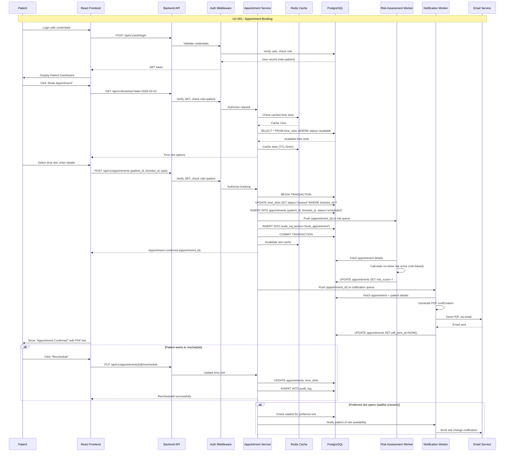
```mermaid
sequenceDiagram
    participant Patient as Patient
    participant Frontend as React Frontend
    participant API as Backend API
    participant Auth as Auth Middleware
    participant ApptService as Appointment Service
    participant Cache as Redis Cache
    participant DB as PostgreSQL
    participant RiskWorker as Risk Assessment Worker
    participant NotifyWorker as Notification Worker
    participant EmailService as Email Service

    Note over Patient,EmailService: UC-001 - Appointment Booking

    Patient->>Frontend: Login with credentials
    Frontend->>API: POST /api/v1/auth/login
    API->>Auth: Validate credentials
    Auth->>DB: Verify user, check role
    DB-->>Auth: User record (role=patient)
    Auth-->>Frontend: JWT token
    Frontend->>Patient: Display Patient Dashboard

    Patient->>Frontend: Click "Book Appointment"
    Frontend->>API: GET /api/v1/timeslots?date=2026-03-20
    API->>Auth: Verify JWT, check role=patient
    Auth->>ApptService: Authorize request
    ApptService->>Cache: Check cached time slots
    Cache-->>ApptService: Cache miss
    ApptService->>DB: SELECT * FROM time_slots WHERE status='available'
    DB-->>ApptService: Available time slots
    ApptService->>Cache: Cache slots (TTL=5min)
    ApptService-->>Frontend: Time slot options

    Patient->>Frontend: Select time slot, enter details
    Frontend->>API: POST /api/v1/appointments {patient_id, timeslot_id, type}
    API->>Auth: Verify JWT, check role=patient
    Auth->>ApptService: Authorize booking
    ApptService->>DB: BEGIN TRANSACTION
    ApptService->>DB: UPDATE time_slots SET status='booked' WHERE timeslot_id=?
    ApptService->>DB: INSERT INTO appointments (patient_id, timeslot_id, status='scheduled')
    ApptService->>RiskWorker: Push {appointment_id} to risk queue
    ApptService->>DB: INSERT INTO audit_log (action='book_appointment')
    ApptService->>DB: COMMIT TRANSACTION
    ApptService->>Cache: Invalidate slot cache
    ApptService-->>Frontend: Appointment confirmed {appointment_id}

    RiskWorker->>DB: Fetch appointment details
    RiskWorker->>RiskWorker: Calculate no-show risk score (rule-based)
    RiskWorker->>DB: UPDATE appointments SET risk_score=?

    ApptService->>NotifyWorker: Push {appointment_id} to notification queue
    NotifyWorker->>DB: Fetch appointment + patient details
    NotifyWorker->>NotifyWorker: Generate PDF confirmation
    NotifyWorker->>EmailService: Send PDF via email
    EmailService-->>NotifyWorker: Email sent
    NotifyWorker->>DB: UPDATE appointments SET pdf_sent_at=NOW()

    Frontend->>Patient: Show "Appointment Confirmed" with PDF link

    alt Patient wants to reschedule
        Patient->>Frontend: Click "Reschedule"
        Frontend->>API: PUT /api/v1/appointments/{id}/reschedule
        API->>ApptService: Update time slot
        ApptService->>DB: UPDATE appointments, time_slots
        ApptService->>DB: INSERT INTO audit_log
        ApptService-->>Frontend: Rescheduled successfully
    end

    alt Preferred slot opens (waitlist scenario)
        ApptService->>DB: Check waitlist for preferred slot
        ApptService->>NotifyWorker: Notify patient of slot availability
        NotifyWorker->>EmailService: Send slot change notification
    end
```

#### UC-002: Patient Intake
**Source**: [spec.md#UC-002](../docs/spec.md#UC-002)

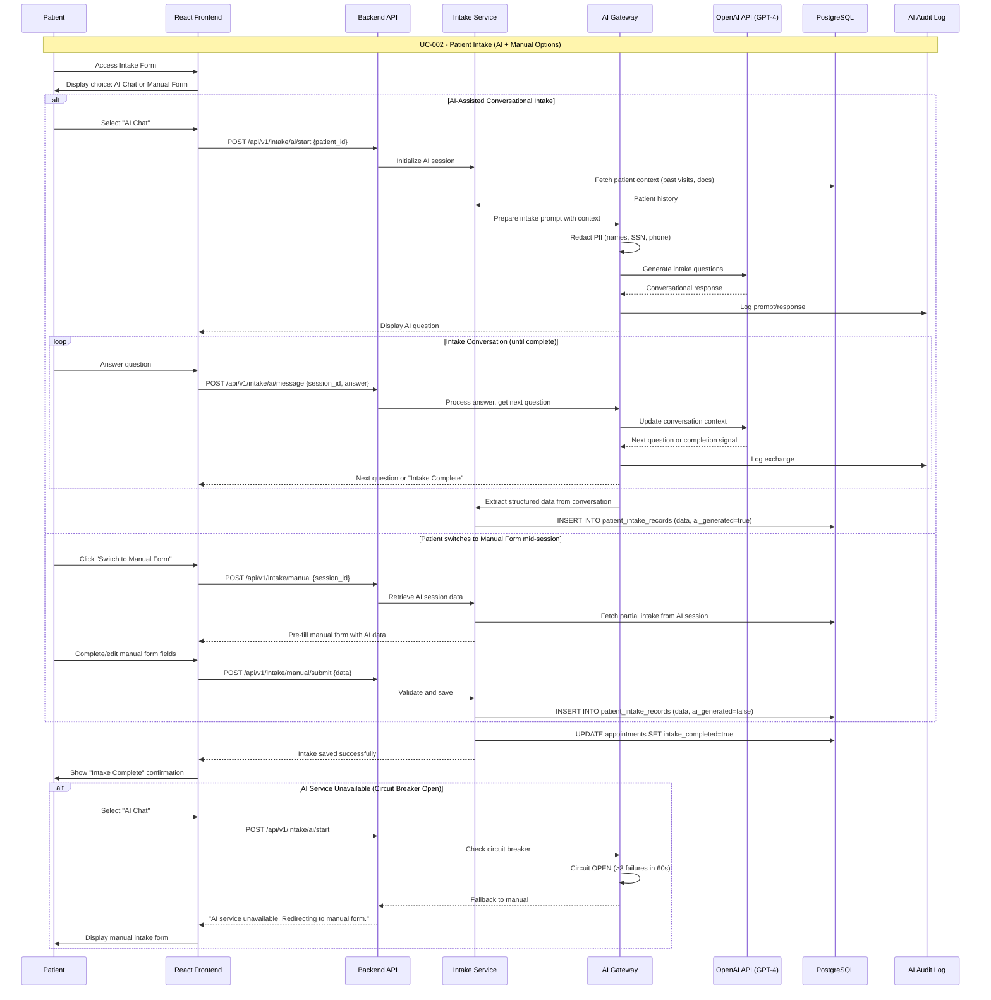
```mermaid
sequenceDiagram
    participant Patient as Patient
    participant Frontend as React Frontend
    participant API as Backend API
    participant IntakeService as Intake Service
    participant AIGateway as AI Gateway
    participant OpenAI as OpenAI API (GPT-4)
    participant DB as PostgreSQL
    participant AuditLog as AI Audit Log

    Note over Patient,AuditLog: UC-002 - Patient Intake (AI + Manual Options)

    Patient->>Frontend: Access Intake Form
    Frontend->>Patient: Display choice: AI Chat or Manual Form

    alt AI-Assisted Conversational Intake
        Patient->>Frontend: Select "AI Chat"
        Frontend->>API: POST /api/v1/intake/ai/start {patient_id}
        API->>IntakeService: Initialize AI session
        IntakeService->>DB: Fetch patient context (past visits, docs)
        DB-->>IntakeService: Patient history
        IntakeService->>AIGateway: Prepare intake prompt with context
        AIGateway->>AIGateway: Redact PII (names, SSN, phone)
        AIGateway->>OpenAI: Generate intake questions
        OpenAI-->>AIGateway: Conversational response
        AIGateway->>AuditLog: Log prompt/response
        AIGateway-->>Frontend: Display AI question

        loop Intake Conversation (until complete)
            Patient->>Frontend: Answer question
            Frontend->>API: POST /api/v1/intake/ai/message {session_id, answer}
            API->>AIGateway: Process answer, get next question
            AIGateway->>OpenAI: Update conversation context
            OpenAI-->>AIGateway: Next question or completion signal
            AIGateway->>AuditLog: Log exchange
            AIGateway-->>Frontend: Next question or "Intake Complete"
        end

        AIGateway->>IntakeService: Extract structured data from conversation
        IntakeService->>DB: INSERT INTO patient_intake_records (data, ai_generated=true)

    else Patient switches to Manual Form mid-session
        Patient->>Frontend: Click "Switch to Manual Form"
        Frontend->>API: POST /api/v1/intake/manual {session_id}
        API->>IntakeService: Retrieve AI session data
        IntakeService->>DB: Fetch partial intake from AI session
        IntakeService-->>Frontend: Pre-fill manual form with AI data
        Patient->>Frontend: Complete/edit manual form fields
        Frontend->>API: POST /api/v1/intake/manual/submit {data}
        API->>IntakeService: Validate and save
        IntakeService->>DB: INSERT INTO patient_intake_records (data, ai_generated=false)
    end

    IntakeService->>DB: UPDATE appointments SET intake_completed=true
    IntakeService-->>Frontend: Intake saved successfully
    Frontend->>Patient: Show "Intake Complete" confirmation

    alt AI Service Unavailable (Circuit Breaker Open)
        Patient->>Frontend: Select "AI Chat"
        Frontend->>API: POST /api/v1/intake/ai/start
        API->>AIGateway: Check circuit breaker
        AIGateway->>AIGateway: Circuit OPEN (>3 failures in 60s)
        AIGateway-->>API: Fallback to manual
        API-->>Frontend: "AI service unavailable. Redirecting to manual form."
        Frontend->>Patient: Display manual intake form
    end
```

#### UC-003: Clinical Data Aggregation
**Source**: [spec.md#UC-003](../docs/spec.md#UC-003)

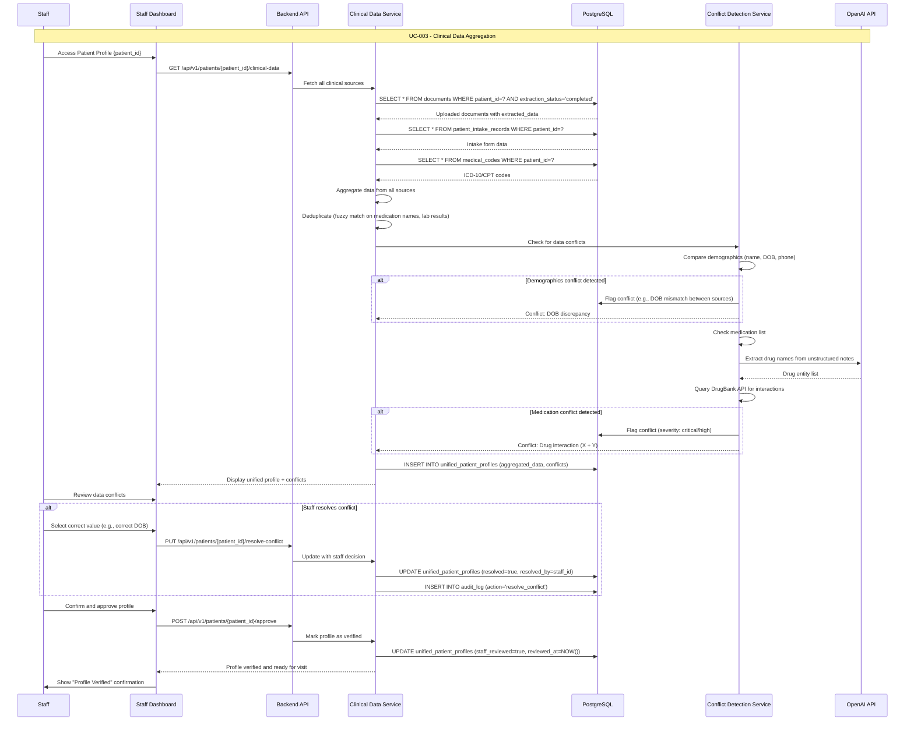
```mermaid
sequenceDiagram
    participant Staff as Staff
    participant Frontend as Staff Dashboard
    participant API as Backend API
    participant ClinicalService as Clinical Data Service
    participant DB as PostgreSQL
    participant ConflictDetector as Conflict Detection Service
    participant OpenAI as OpenAI API

    Note over Staff,OpenAI: UC-003 - Clinical Data Aggregation

    Staff->>Frontend: Access Patient Profile {patient_id}
    Frontend->>API: GET /api/v1/patients/{patient_id}/clinical-data
    API->>ClinicalService: Fetch all clinical sources
    ClinicalService->>DB: SELECT * FROM documents WHERE patient_id=? AND extraction_status='completed'
    DB-->>ClinicalService: Uploaded documents with extracted_data
    ClinicalService->>DB: SELECT * FROM patient_intake_records WHERE patient_id=?
    DB-->>ClinicalService: Intake form data
    ClinicalService->>DB: SELECT * FROM medical_codes WHERE patient_id=?
    DB-->>ClinicalService: ICD-10/CPT codes

    ClinicalService->>ClinicalService: Aggregate data from all sources
    ClinicalService->>ClinicalService: Deduplicate (fuzzy match on medication names, lab results)
    ClinicalService->>ConflictDetector: Check for data conflicts

    ConflictDetector->>ConflictDetector: Compare demographics (name, DOB, phone)
    alt Demographics conflict detected
        ConflictDetector->>DB: Flag conflict (e.g., DOB mismatch between sources)
        ConflictDetector-->>ClinicalService: Conflict: DOB discrepancy
    end

    ConflictDetector->>ConflictDetector: Check medication list
    ConflictDetector->>OpenAI: Extract drug names from unstructured notes
    OpenAI-->>ConflictDetector: Drug entity list
    ConflictDetector->>ConflictDetector: Query DrugBank API for interactions
    alt Medication conflict detected
        ConflictDetector->>DB: Flag conflict (severity: critical/high)
        ConflictDetector-->>ClinicalService: Conflict: Drug interaction (X + Y)
    end

    ClinicalService->>DB: INSERT INTO unified_patient_profiles (aggregated_data, conflicts)
    ClinicalService-->>Frontend: Display unified profile + conflicts

    Staff->>Frontend: Review data conflicts
    alt Staff resolves conflict
        Staff->>Frontend: Select correct value (e.g., correct DOB)
        Frontend->>API: PUT /api/v1/patients/{patient_id}/resolve-conflict
        API->>ClinicalService: Update with staff decision
        ClinicalService->>DB: UPDATE unified_patient_profiles (resolved=true, resolved_by=staff_id)
        ClinicalService->>DB: INSERT INTO audit_log (action='resolve_conflict')
    end

    Staff->>Frontend: Confirm and approve profile
    Frontend->>API: POST /api/v1/patients/{patient_id}/approve
    API->>ClinicalService: Mark profile as verified
    ClinicalService->>DB: UPDATE unified_patient_profiles (staff_reviewed=true, reviewed_at=NOW())
    ClinicalService-->>Frontend: Profile verified and ready for visit
    Frontend->>Staff: Show "Profile Verified" confirmation
```

#### UC-004: Send Appointment Details as PDF
**Source**: [spec.md#UC-004](../docs/spec.md#UC-004)

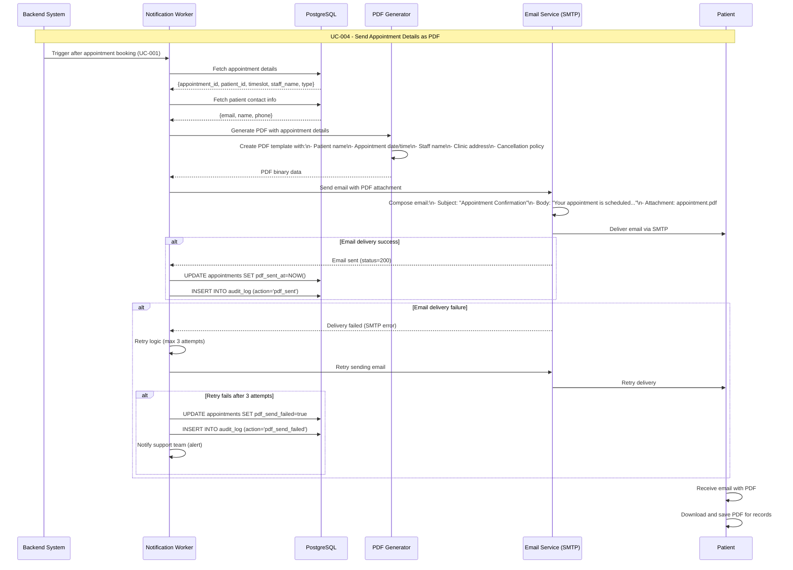
```mermaid
sequenceDiagram
    participant System as Backend System
    participant NotifyWorker as Notification Worker
    participant DB as PostgreSQL
    participant PDFGen as PDF Generator
    participant EmailService as Email Service (SMTP)
    participant Patient as Patient

    Note over System,Patient: UC-004 - Send Appointment Details as PDF

    System->>NotifyWorker: Trigger after appointment booking (UC-001)
    NotifyWorker->>DB: Fetch appointment details
    DB-->>NotifyWorker: {appointment_id, patient_id, timeslot, staff_name, type}
    NotifyWorker->>DB: Fetch patient contact info
    DB-->>NotifyWorker: {email, name, phone}

    NotifyWorker->>PDFGen: Generate PDF with appointment details
    PDFGen->>PDFGen: Create PDF template with:\n- Patient name\n- Appointment date/time\n- Staff name\n- Clinic address\n- Cancellation policy
    PDFGen-->>NotifyWorker: PDF binary data

    NotifyWorker->>EmailService: Send email with PDF attachment
    EmailService->>EmailService: Compose email:\n- Subject: "Appointment Confirmation"\n- Body: "Your appointment is scheduled..."\n- Attachment: appointment.pdf
    EmailService->>Patient: Deliver email via SMTP

    alt Email delivery success
        EmailService-->>NotifyWorker: Email sent (status=200)
        NotifyWorker->>DB: UPDATE appointments SET pdf_sent_at=NOW()
        NotifyWorker->>DB: INSERT INTO audit_log (action='pdf_sent')
    end

    alt Email delivery failure
        EmailService-->>NotifyWorker: Delivery failed (SMTP error)
        NotifyWorker->>NotifyWorker: Retry logic (max 3 attempts)
        NotifyWorker->>EmailService: Retry sending email
        EmailService->>Patient: Retry delivery

        alt Retry fails after 3 attempts
            NotifyWorker->>DB: UPDATE appointments SET pdf_send_failed=true
            NotifyWorker->>DB: INSERT INTO audit_log (action='pdf_send_failed')
            NotifyWorker->>NotifyWorker: Notify support team (alert)
        end
    end

    Patient->>Patient: Receive email with PDF
    Patient->>Patient: Download and save PDF for records
```

#### UC-005: Rule Based No Show Risk Assessment
**Source**: [spec.md#UC-005](../docs/spec.md#UC-005)

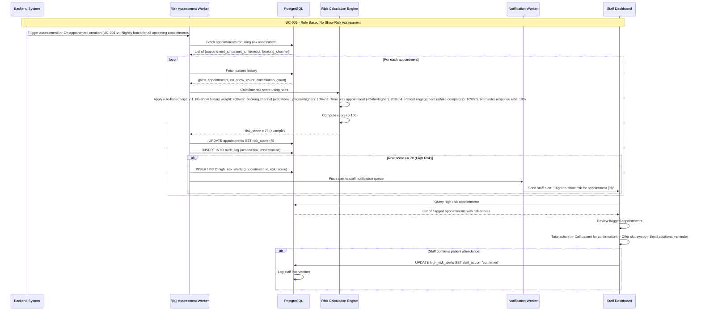
```mermaid
sequenceDiagram
    participant System as Backend System
    participant RiskWorker as Risk Assessment Worker
    participant DB as PostgreSQL
    participant RiskEngine as Risk Calculation Engine
    participant NotifyWorker as Notification Worker
    participant Staff as Staff Dashboard

    Note over System,Staff: UC-005 - Rule Based No Show Risk Assessment

    System->>RiskWorker: Trigger assessment:\n- On appointment creation (UC-001)\n- Nightly batch for all upcoming appointments
    RiskWorker->>DB: Fetch appointments requiring risk assessment
    DB-->>RiskWorker: List of {appointment_id, patient_id, timeslot, booking_channel}

    loop For each appointment
        RiskWorker->>DB: Fetch patient history
        DB-->>RiskWorker: {past_appointments, no_show_count, cancellation_count}

        RiskWorker->>RiskEngine: Calculate risk score using rules
        RiskEngine->>RiskEngine: Apply rule-based logic:\n1. No-show history weight: 40%\n2. Booking channel (web=lower, phone=higher): 20%\n3. Time until appointment (<24hr=higher): 20%\n4. Patient engagement (intake complete?): 10%\n5. Reminder response rate: 10%
        RiskEngine->>RiskEngine: Compute score (0-100)
        RiskEngine-->>RiskWorker: risk_score = 75 (example)

        RiskWorker->>DB: UPDATE appointments SET risk_score=75
        RiskWorker->>DB: INSERT INTO audit_log (action='risk_assessment')

        alt Risk score >= 70 (High Risk)
            RiskWorker->>DB: INSERT INTO high_risk_alerts (appointment_id, risk_score)
            RiskWorker->>NotifyWorker: Push alert to staff notification queue
            NotifyWorker->>Staff: Send staff alert: "High no-show risk for appointment {id}"
        end
    end

    Staff->>DB: Query high-risk appointments
    DB-->>Staff: List of flagged appointments with risk scores
    Staff->>Staff: Review flagged appointments
    Staff->>Staff: Take action:\n- Call patient for confirmation\n- Offer slot swap\n- Send additional reminder

    alt Staff confirms patient attendance
        Staff->>DB: UPDATE high_risk_alerts SET staff_action='confirmed'
        DB->>DB: Log staff intervention
    end
```

#### UC-006: Admin User Management
**Source**: [spec.md#UC-006](../docs/spec.md#UC-006)

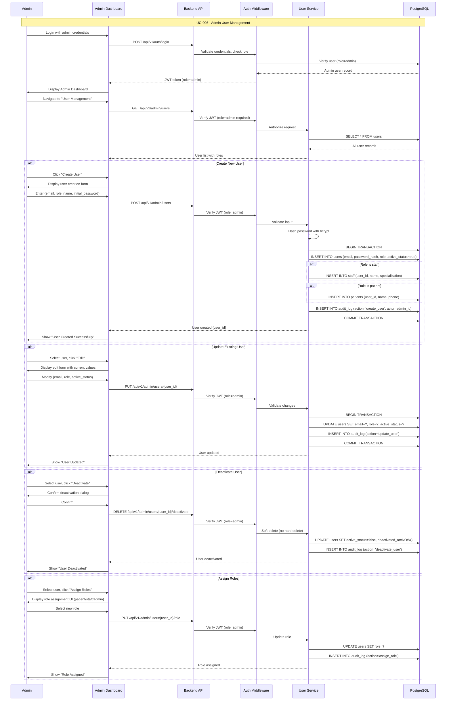
```mermaid
sequenceDiagram
    participant Admin as Admin
    participant Frontend as Admin Dashboard
    participant API as Backend API
    participant Auth as Auth Middleware
    participant UserService as User Service
    participant DB as PostgreSQL

    Note over Admin,DB: UC-006 - Admin User Management

    Admin->>Frontend: Login with admin credentials
    Frontend->>API: POST /api/v1/auth/login
    API->>Auth: Validate credentials, check role
    Auth->>DB: Verify user (role=admin)
    DB-->>Auth: Admin user record
    Auth-->>Frontend: JWT token (role=admin)
    Frontend->>Admin: Display Admin Dashboard

    Admin->>Frontend: Navigate to "User Management"
    Frontend->>API: GET /api/v1/admin/users
    API->>Auth: Verify JWT (role=admin required)
    Auth->>UserService: Authorize request
    UserService->>DB: SELECT * FROM users
    DB-->>UserService: All user records
    UserService-->>Frontend: User list with roles

    alt Create New User
        Admin->>Frontend: Click "Create User"
        Frontend->>Admin: Display user creation form
        Admin->>Frontend: Enter {email, role, name, initial_password}
        Frontend->>API: POST /api/v1/admin/users
        API->>Auth: Verify JWT (role=admin)
        Auth->>UserService: Validate input
        UserService->>UserService: Hash password with bcrypt
        UserService->>DB: BEGIN TRANSACTION
        UserService->>DB: INSERT INTO users (email, password_hash, role, active_status=true)
        alt Role is staff
            UserService->>DB: INSERT INTO staff (user_id, name, specialization)
        end
        alt Role is patient
            UserService->>DB: INSERT INTO patients (user_id, name, phone)
        end
        UserService->>DB: INSERT INTO audit_log (action='create_user', actor=admin_id)
        UserService->>DB: COMMIT TRANSACTION
        UserService-->>Frontend: User created {user_id}
        Frontend->>Admin: Show "User Created Successfully"
    end

    alt Update Existing User
        Admin->>Frontend: Select user, click "Edit"
        Frontend->>Admin: Display edit form with current values
        Admin->>Frontend: Modify {email, role, active_status}
        Frontend->>API: PUT /api/v1/admin/users/{user_id}
        API->>Auth: Verify JWT (role=admin)
        Auth->>UserService: Validate changes
        UserService->>DB: BEGIN TRANSACTION
        UserService->>DB: UPDATE users SET email=?, role=?, active_status=?
        UserService->>DB: INSERT INTO audit_log (action='update_user')
        UserService->>DB: COMMIT TRANSACTION
        UserService-->>Frontend: User updated
        Frontend->>Admin: Show "User Updated"
    end

    alt Deactivate User
        Admin->>Frontend: Select user, click "Deactivate"
        Frontend->>Admin: Confirm deactivation dialog
        Admin->>Frontend: Confirm
        Frontend->>API: DELETE /api/v1/admin/users/{user_id}/deactivate
        API->>Auth: Verify JWT (role=admin)
        Auth->>UserService: Soft delete (no hard delete)
        UserService->>DB: UPDATE users SET active_status=false, deactivated_at=NOW()
        UserService->>DB: INSERT INTO audit_log (action='deactivate_user')
        UserService-->>Frontend: User deactivated
        Frontend->>Admin: Show "User Deactivated"
    end

    alt Assign Roles
        Admin->>Frontend: Select user, click "Assign Roles"
        Frontend->>Admin: Display role assignment UI (patient/staff/admin)
        Admin->>Frontend: Select new role
        Frontend->>API: PUT /api/v1/admin/users/{user_id}/role
        API->>Auth: Verify JWT (role=admin)
        Auth->>UserService: Update role
        UserService->>DB: UPDATE users SET role=?
        UserService->>DB: INSERT INTO audit_log (action='assign_role')
        UserService-->>Frontend: Role assigned
        Frontend->>Admin: Show "Role Assigned"
    end
```

#### UC-007: Staff Walk-in and Queue Management
**Source**: [spec.md#UC-007](../docs/spec.md#UC-007)

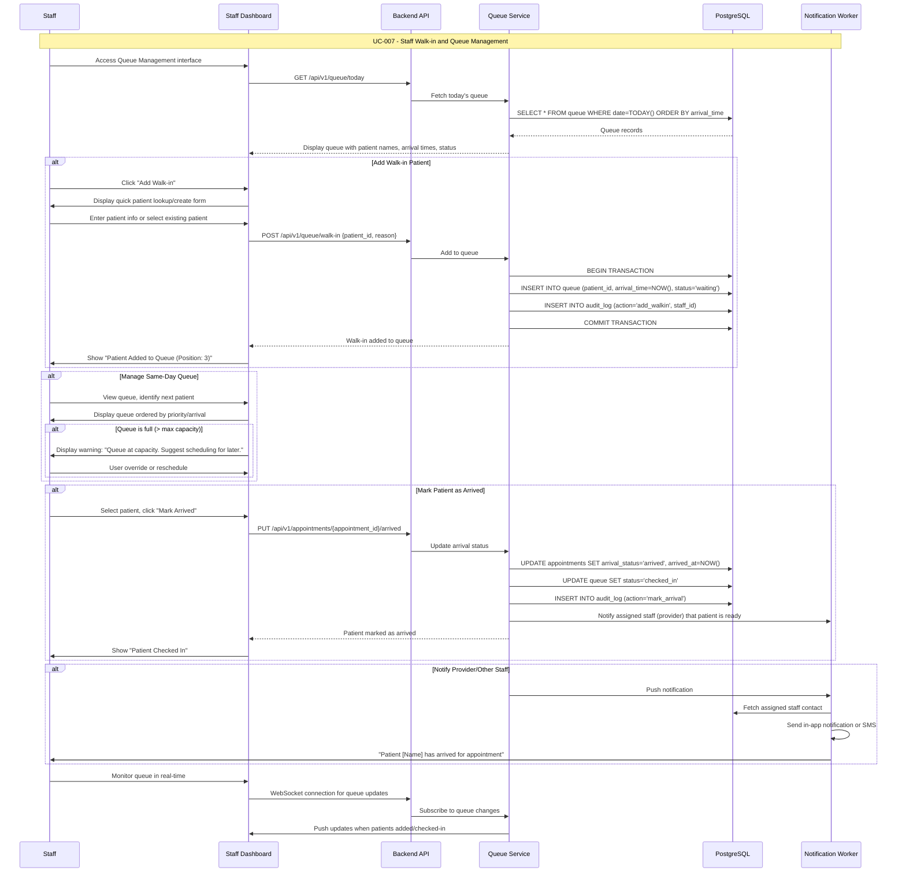
```mermaid
sequenceDiagram
    participant Staff as Staff
    participant Frontend as Staff Dashboard
    participant API as Backend API
    participant QueueService as Queue Service
    participant DB as PostgreSQL
    participant NotifyWorker as Notification Worker

    Note over Staff,NotifyWorker: UC-007 - Staff Walk-in and Queue Management

    Staff->>Frontend: Access Queue Management interface
    Frontend->>API: GET /api/v1/queue/today
    API->>QueueService: Fetch today's queue
    QueueService->>DB: SELECT * FROM queue WHERE date=TODAY() ORDER BY arrival_time
    DB-->>QueueService: Queue records
    QueueService-->>Frontend: Display queue with patient names, arrival times, status

    alt Add Walk-in Patient
        Staff->>Frontend: Click "Add Walk-in"
        Frontend->>Staff: Display quick patient lookup/create form
        Staff->>Frontend: Enter patient info or select existing patient
        Frontend->>API: POST /api/v1/queue/walk-in {patient_id, reason}
        API->>QueueService: Add to queue
        QueueService->>DB: BEGIN TRANSACTION
        QueueService->>DB: INSERT INTO queue (patient_id, arrival_time=NOW(), status='waiting')
        QueueService->>DB: INSERT INTO audit_log (action='add_walkin', staff_id)
        QueueService->>DB: COMMIT TRANSACTION
        QueueService-->>Frontend: Walk-in added to queue
        Frontend->>Staff: Show "Patient Added to Queue (Position: 3)"
    end

    alt Manage Same-Day Queue
        Staff->>Frontend: View queue, identify next patient
        Frontend->>Staff: Display queue ordered by priority/arrival

        alt Queue is full (> max capacity)
            Frontend->>Staff: Display warning: "Queue at capacity. Suggest scheduling for later."
            Staff->>Frontend: User override or reschedule
        end
    end

    alt Mark Patient as Arrived
        Staff->>Frontend: Select patient, click "Mark Arrived"
        Frontend->>API: PUT /api/v1/appointments/{appointment_id}/arrived
        API->>QueueService: Update arrival status
        QueueService->>DB: UPDATE appointments SET arrival_status='arrived', arrived_at=NOW()
        QueueService->>DB: UPDATE queue SET status='checked_in'
        QueueService->>DB: INSERT INTO audit_log (action='mark_arrival')
        QueueService->>NotifyWorker: Notify assigned staff (provider) that patient is ready
        QueueService-->>Frontend: Patient marked as arrived
        Frontend->>Staff: Show "Patient Checked In"
    end

    alt Notify Provider/Other Staff
        QueueService->>NotifyWorker: Push notification
        NotifyWorker->>DB: Fetch assigned staff contact
        NotifyWorker->>NotifyWorker: Send in-app notification or SMS
        NotifyWorker->>Staff: "Patient [Name] has arrived for appointment"
    end

    Staff->>Frontend: Monitor queue in real-time
    Frontend->>API: WebSocket connection for queue updates
    API->>QueueService: Subscribe to queue changes
    QueueService->>Frontend: Push updates when patients added/checked-in
```

#### UC-008: Role-Based Access Control and Audit Logging
**Source**: [spec.md#UC-008](../docs/spec.md#UC-008)

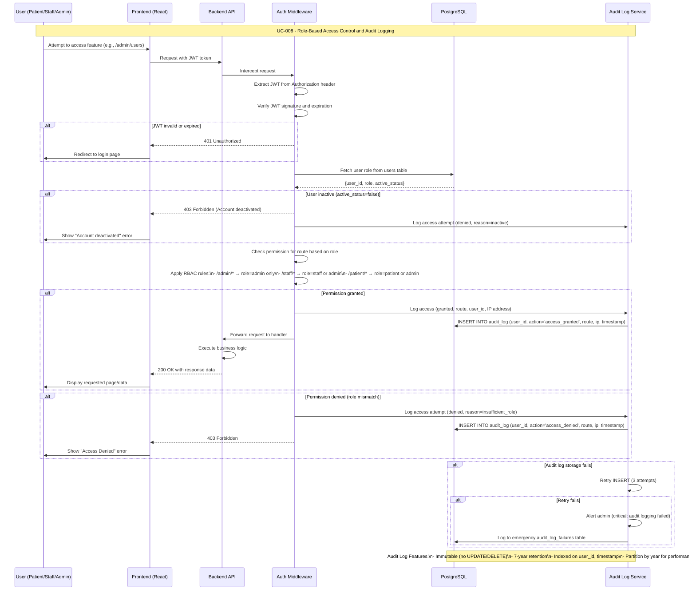
```mermaid
sequenceDiagram
    participant User as User (Patient/Staff/Admin)
    participant Frontend as Frontend (React)
    participant API as Backend API
    participant AuthMiddleware as Auth Middleware
    participant DB as PostgreSQL
    participant AuditLog as Audit Log Service

    Note over User,AuditLog: UC-008 - Role-Based Access Control and Audit Logging

    User->>Frontend: Attempt to access feature (e.g., /admin/users)
    Frontend->>API: Request with JWT token
    API->>AuthMiddleware: Intercept request
    AuthMiddleware->>AuthMiddleware: Extract JWT from Authorization header
    AuthMiddleware->>AuthMiddleware: Verify JWT signature and expiration

    alt JWT invalid or expired
        AuthMiddleware-->>Frontend: 401 Unauthorized
        Frontend->>User: Redirect to login page
    end

    AuthMiddleware->>DB: Fetch user role from users table
    DB-->>AuthMiddleware: {user_id, role, active_status}

    alt User inactive (active_status=false)
        AuthMiddleware-->>Frontend: 403 Forbidden (Account deactivated)
        AuthMiddleware->>AuditLog: Log access attempt (denied, reason=inactive)
        Frontend->>User: Show "Account deactivated" error
    end

    AuthMiddleware->>AuthMiddleware: Check permission for route based on role
    AuthMiddleware->>AuthMiddleware: Apply RBAC rules:\n- /admin/* → role=admin only\n- /staff/* → role=staff or admin\n- /patient/* → role=patient or admin

    alt Permission granted
        AuthMiddleware->>AuditLog: Log access (granted, route, user_id, IP address)
        AuditLog->>DB: INSERT INTO audit_log (user_id, action='access_granted', route, ip, timestamp)
        AuthMiddleware->>API: Forward request to handler
        API->>API: Execute business logic
        API-->>Frontend: 200 OK with response data
        Frontend->>User: Display requested page/data
    end

    alt Permission denied (role mismatch)
        AuthMiddleware->>AuditLog: Log access attempt (denied, reason=insufficient_role)
        AuditLog->>DB: INSERT INTO audit_log (user_id, action='access_denied', route, ip, timestamp)
        AuthMiddleware-->>Frontend: 403 Forbidden
        Frontend->>User: Show "Access Denied" error
    end

    alt Audit log storage fails
        AuditLog->>AuditLog: Retry INSERT (3 attempts)
        alt Retry fails
            AuditLog->>AuditLog: Alert admin (critical: audit logging failed)
            AuditLog->>DB: Log to emergency audit_log_failures table
        end
    end

    Note over AuditLog,DB: Audit Log Features:\n- Immutable (no UPDATE/DELETE)\n- 7-year retention\n- Indexed on user_id, timestamp\n- Partition by year for performance
```

#### UC-009: Restrict Patient Self-Check-In
**Source**: [spec.md#UC-009](../docs/spec.md#UC-009)

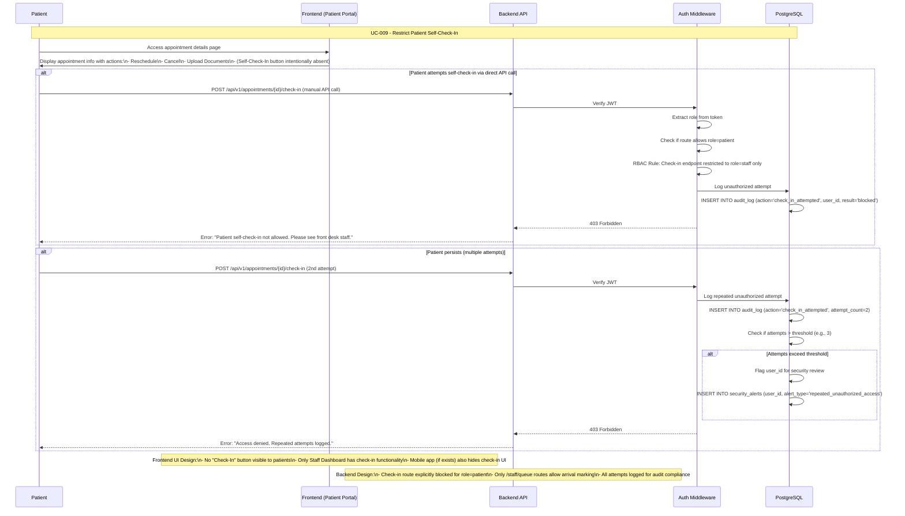
```mermaid
sequenceDiagram
    participant Patient as Patient
    participant Frontend as Frontend (Patient Portal)
    participant API as Backend API
    participant AuthMiddleware as Auth Middleware
    participant DB as PostgreSQL

    Note over Patient,DB: UC-009 - Restrict Patient Self-Check-In

    Patient->>Frontend: Access appointment details page
    Frontend->>Patient: Display appointment info with actions:\n- Reschedule\n- Cancel\n- Upload Documents\n- (Self-Check-In button intentionally absent)

    alt Patient attempts self-check-in via direct API call
        Patient->>API: POST /api/v1/appointments/{id}/check-in (manual API call)
        API->>AuthMiddleware: Verify JWT
        AuthMiddleware->>AuthMiddleware: Extract role from token
        AuthMiddleware->>AuthMiddleware: Check if route allows role=patient

        AuthMiddleware->>AuthMiddleware: RBAC Rule: Check-in endpoint restricted to role=staff only
        AuthMiddleware->>DB: Log unauthorized attempt
        DB->>DB: INSERT INTO audit_log (action='check_in_attempted', user_id, result='blocked')
        AuthMiddleware-->>API: 403 Forbidden
        API-->>Patient: Error: "Patient self-check-in not allowed. Please see front desk staff."
    end

    alt Patient persists (multiple attempts)
        Patient->>API: POST /api/v1/appointments/{id}/check-in (2nd attempt)
        API->>AuthMiddleware: Verify JWT
        AuthMiddleware->>DB: Log repeated unauthorized attempt
        DB->>DB: INSERT INTO audit_log (action='check_in_attempted', attempt_count=2)
        DB->>DB: Check if attempts > threshold (e.g., 3)
        alt Attempts exceed threshold
            DB->>DB: Flag user_id for security review
            DB->>DB: INSERT INTO security_alerts (user_id, alert_type='repeated_unauthorized_access')
        end
        AuthMiddleware-->>API: 403 Forbidden
        API-->>Patient: Error: "Access denied. Repeated attempts logged."
    end

    Note over Frontend: Frontend UI Design:\n- No "Check-In" button visible to patients\n- Only Staff Dashboard has check-in functionality\n- Mobile app (if exists) also hides check-in UI

    Note over API: Backend Design:\n- Check-in route explicitly blocked for role=patient\n- Only /staff/queue routes allow arrival marking\n- All attempts logged for audit compliance
```

#### UC-010: Highlight Medication Conflicts
**Source**: [spec.md#UC-010](../docs/spec.md#UC-010)

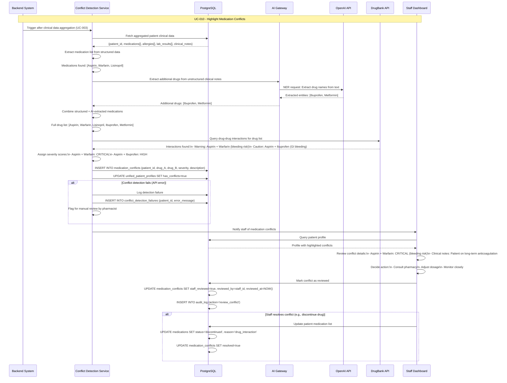
```mermaid
sequenceDiagram
    participant System as Backend System
    participant ConflictService as Conflict Detection Service
    participant DB as PostgreSQL
    participant AIGateway as AI Gateway
    participant OpenAI as OpenAI API
    participant DrugDB as DrugBank API
    participant Staff as Staff Dashboard

    Note over System,Staff: UC-010 - Highlight Medication Conflicts

    System->>ConflictService: Trigger after clinical data aggregation (UC-003)
    ConflictService->>DB: Fetch aggregated patient clinical data
    DB-->>ConflictService: {patient_id, medications[], allergies[], lab_results[], clinical_notes}

    ConflictService->>ConflictService: Extract medication list from structured data
    ConflictService->>ConflictService: Medications found: [Aspirin, Warfarin, Lisinopril]

    ConflictService->>AIGateway: Extract additional drugs from unstructured clinical notes
    AIGateway->>OpenAI: NER request: Extract drug names from text
    OpenAI-->>AIGateway: Extracted entities: [Ibuprofen, Metformin]
    AIGateway-->>ConflictService: Additional drugs: [Ibuprofen, Metformin]

    ConflictService->>ConflictService: Combine structured + AI-extracted medications
    ConflictService->>ConflictService: Full drug list: [Aspirin, Warfarin, Lisinopril, Ibuprofen, Metformin]

    ConflictService->>DrugDB: Query drug-drug interactions for drug list
    DrugDB-->>ConflictService: Interactions found:\n- Warning: Aspirin + Warfarin (bleeding risk)\n- Caution: Aspirin + Ibuprofen (GI bleeding)

    ConflictService->>ConflictService: Assign severity scores:\n- Aspirin + Warfarin: CRITICAL\n- Aspirin + Ibuprofen: HIGH

    ConflictService->>DB: INSERT INTO medication_conflicts (patient_id, drug_A, drug_B, severity, description)
    ConflictService->>DB: UPDATE unified_patient_profiles SET has_conflicts=true

    alt Conflict detection fails (API error)
        ConflictService->>DB: Log detection failure
        ConflictService->>DB: INSERT INTO conflict_detection_failures (patient_id, error_message)
        ConflictService->>ConflictService: Flag for manual review by pharmacist
    end

    ConflictService->>Staff: Notify staff of medication conflicts
    Staff->>DB: Query patient profile
    DB-->>Staff: Profile with highlighted conflicts

    Staff->>Staff: Review conflict details:\n- Aspirin + Warfarin: CRITICAL (bleeding risk)\n- Clinical notes: Patient on long-term anticoagulation
    Staff->>Staff: Decide action:\n- Consult pharmacy\n- Adjust dosage\n- Monitor closely

    Staff->>DB: Mark conflict as reviewed
    DB->>DB: UPDATE medication_conflicts SET staff_reviewed=true, reviewed_by=staff_id, reviewed_at=NOW()
    DB->>DB: INSERT INTO audit_log (action='review_conflict')

    alt Staff resolves conflict (e.g., discontinue drug)
        Staff->>DB: Update patient medication list
        DB->>DB: UPDATE medications SET status='discontinued', reason='drug_interaction'
        DB->>DB: UPDATE medication_conflicts SET resolved=true
    end
```

#### UC-011: Staff Mark No Show
**Source**: [spec.md#UC-011](../docs/spec.md#UC-011)

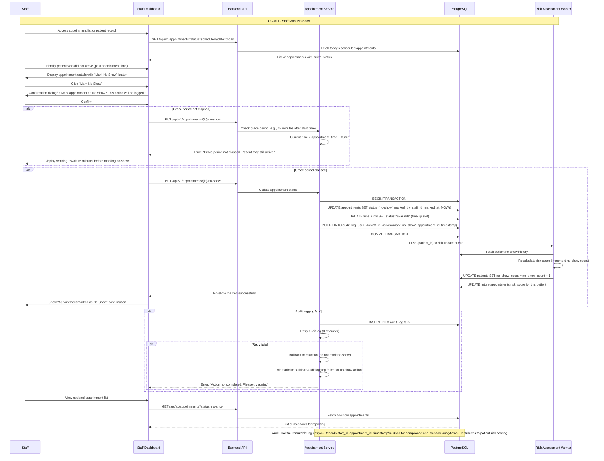
```mermaid
sequenceDiagram
    participant Staff as Staff
    participant Frontend as Staff Dashboard
    participant API as Backend API
    participant ApptService as Appointment Service
    participant DB as PostgreSQL
    participant RiskWorker as Risk Assessment Worker

    Note over Staff,RiskWorker: UC-011 - Staff Mark No Show

    Staff->>Frontend: Access appointment list or patient record
    Frontend->>API: GET /api/v1/appointments?status=scheduled&date=today
    API->>DB: Fetch today's scheduled appointments
    DB-->>Frontend: List of appointments with arrival status

    Staff->>Frontend: Identify patient who did not arrive (past appointment time)
    Frontend->>Staff: Display appointment details with "Mark No Show" button

    Staff->>Frontend: Click "Mark No Show"
    Frontend->>Staff: Confirmation dialog:\n"Mark appointment as No Show? This action will be logged."
    Staff->>Frontend: Confirm

    alt Grace period not elapsed
        Frontend->>API: PUT /api/v1/appointments/{id}/no-show
        API->>ApptService: Check grace period (e.g., 15 minutes after start time)
        ApptService->>ApptService: Current time < appointment_time + 15min
        ApptService-->>Frontend: Error: "Grace period not elapsed. Patient may still arrive."
        Frontend->>Staff: Display warning: "Wait 15 minutes before marking no-show"
    end

    alt Grace period elapsed
        Frontend->>API: PUT /api/v1/appointments/{id}/no-show
        API->>ApptService: Update appointment status
        ApptService->>DB: BEGIN TRANSACTION
        ApptService->>DB: UPDATE appointments SET status='no-show', marked_by=staff_id, marked_at=NOW()
        ApptService->>DB: UPDATE time_slots SET status='available' (free up slot)
        ApptService->>DB: INSERT INTO audit_log (user_id=staff_id, action='mark_no_show', appointment_id, timestamp)
        ApptService->>DB: COMMIT TRANSACTION

        ApptService->>RiskWorker: Push {patient_id} to risk update queue
        RiskWorker->>DB: Fetch patient no-show history
        RiskWorker->>RiskWorker: Recalculate risk score (increment no-show count)
        RiskWorker->>DB: UPDATE patients SET no_show_count = no_show_count + 1
        RiskWorker->>DB: UPDATE future appointments risk_score for this patient

        ApptService-->>Frontend: No-show marked successfully
        Frontend->>Staff: Show "Appointment marked as No Show" confirmation
    end

    alt Audit logging fails
        ApptService->>DB: INSERT INTO audit_log fails
        ApptService->>ApptService: Retry audit log (3 attempts)
        alt Retry fails
            ApptService->>ApptService: Rollback transaction (do not mark no-show)
            ApptService->>ApptService: Alert admin: "Critical: Audit logging failed for no-show action"
            ApptService-->>Frontend: Error: "Action not completed. Please try again."
        end
    end

    Staff->>Frontend: View updated appointment list
    Frontend->>API: GET /api/v1/appointments?status=no-show
    API->>DB: Fetch no-show appointments
    DB-->>Frontend: List of no-shows for reporting

    Note over ApptService,DB: Audit Trail:\n- Immutable log entry\n- Records staff_id, appointment_id, timestamp\n- Used for compliance and no-show analytics\n- Contributes to patient risk scoring
```

#### UC-012: Patient Dashboard Access
**Source**: [spec.md#UC-012](../docs/spec.md#UC-012)

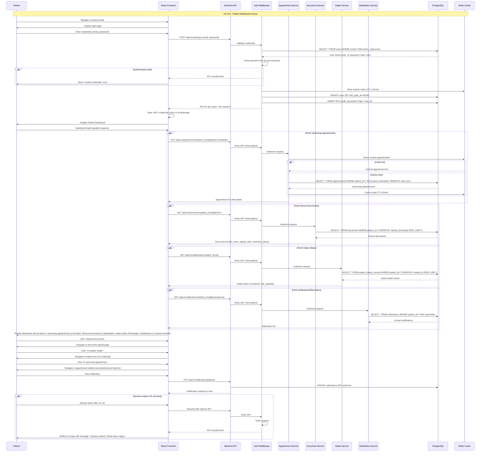
```mermaid
sequenceDiagram
    participant Patient as Patient
    participant Frontend as React Frontend
    participant API as Backend API
    participant Auth as Auth Middleware
    participant ApptService as Appointment Service
    participant DocService as Document Service
    participant IntakeService as Intake Service
    participant NotifyService as Notification Service
    participant DB as PostgreSQL
    participant Cache as Redis Cache

    Note over Patient,Cache: UC-012 - Patient Dashboard Access

    Patient->>Frontend: Navigate to patient portal
    Frontend->>Patient: Display login page

    Patient->>Frontend: Enter credentials (email, password)
    Frontend->>API: POST /api/v1/auth/login {email, password}
    API->>Auth: Validate credentials
    Auth->>DB: SELECT * FROM users WHERE email=? AND active_status=true
    DB-->>Auth: User record {user_id, password_hash, role}
    Auth->>Auth: Verify password with bcrypt.compare()

    alt Authentication fails
        Auth-->>Frontend: 401 Unauthorized
        Frontend->>Patient: Show "Invalid credentials" error
    end

    Auth->>Cache: Store session token (TTL=15min)
    Auth->>DB: UPDATE users SET last_login_at=NOW()
    Auth->>DB: INSERT INTO audit_log (action='login', user_id)
    Auth-->>Frontend: 200 OK {jwt_token, role='patient'}
    Frontend->>Frontend: Store JWT in httpOnly cookie or localStorage

    Frontend->>Patient: Display Patient Dashboard

    Patient->>Frontend: Dashboard loads (parallel requests)

    par Fetch Upcoming Appointments
        Frontend->>API: GET /api/v1/appointments?patient_id={id}&status=scheduled
        API->>Auth: Verify JWT (role=patient)
        Auth->>ApptService: Authorize request
        ApptService->>Cache: Check cached appointments
        alt Cache hit
            Cache-->>ApptService: Cached appointment list
        else Cache miss
            ApptService->>DB: SELECT * FROM appointments WHERE patient_id=? AND status='scheduled' ORDER BY start_time
            DB-->>ApptService: Upcoming appointments
            ApptService->>Cache: Cache result (TTL=5min)
        end
        ApptService-->>Frontend: Appointment list with details
    end

    par Fetch Recent Documents
        Frontend->>API: GET /api/v1/documents?patient_id={id}&limit=5
        API->>Auth: Verify JWT (role=patient)
        Auth->>DocService: Authorize request
        DocService->>DB: SELECT * FROM documents WHERE patient_id=? ORDER BY upload_timestamp DESC LIMIT 5
        DB-->>DocService: Recent documents
        DocService-->>Frontend: Document list {file_name, upload_date, extraction_status}
    end

    par Fetch Intake Status
        Frontend->>API: GET /api/v1/intake/status?patient_id={id}
        API->>Auth: Verify JWT (role=patient)
        Auth->>IntakeService: Authorize request
        IntakeService->>DB: SELECT * FROM patient_intake_records WHERE patient_id=? ORDER BY created_at DESC LIMIT 1
        DB-->>IntakeService: Latest intake record
        IntakeService-->>Frontend: Intake status {completed, last_updated}
    end

    par Fetch Notifications/Reminders
        Frontend->>API: GET /api/v1/notifications?patient_id={id}&unread=true
        API->>Auth: Verify JWT (role=patient)
        Auth->>NotifyService: Authorize request
        NotifyService->>DB: SELECT * FROM notifications WHERE patient_id=? AND read=false
        DB-->>NotifyService: Unread notifications
        NotifyService-->>Frontend: Notification list
    end

    Frontend->>Patient: Render dashboard with all data:\n- Upcoming appointments (3 found)\n- Recent documents (2 uploaded)\n- Intake status (Pending)\n- Notifications (1 unread reminder)

    Patient->>Frontend: Click "Upload Documents"
    Frontend->>Patient: Navigate to document upload page

    Patient->>Frontend: Click "Complete Intake"
    Frontend->>Patient: Navigate to intake form (AI or Manual)

    Patient->>Frontend: Click on upcoming appointment
    Frontend->>Patient: Navigate to appointment details (reschedule/cancel options)

    Patient->>Frontend: View notification
    Frontend->>API: PUT /api/v1/notifications/{id}/read
    API->>DB: UPDATE notifications SET read=true
    API-->>Frontend: Notification marked as read

    alt Session expires (15 minutes)
        Patient->>Frontend: Attempt action after 15 min
        Frontend->>API: Request with expired JWT
        API->>Auth: Verify JWT
        Auth->>Auth: Token expired
        Auth-->>Frontend: 401 Unauthorized
        Frontend->>Patient: Redirect to login with message: "Session expired. Please log in again."
    end
```

## AI Architecture Diagrams

### RAG Pipeline Diagram
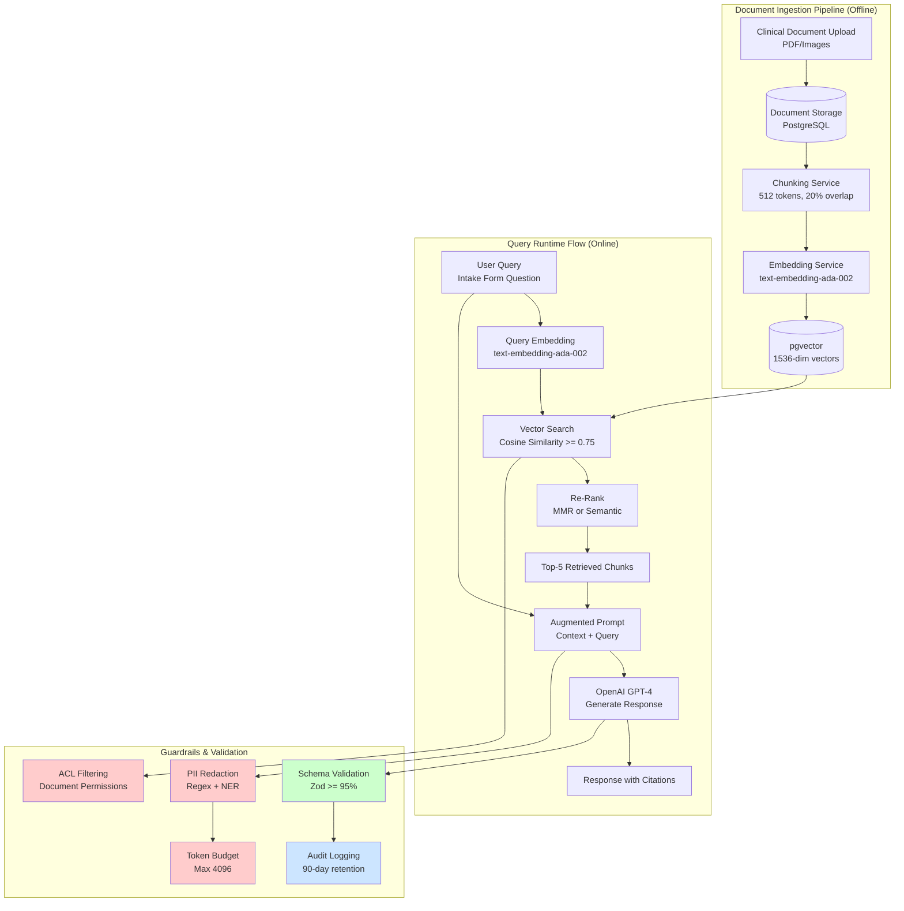
```mermaid
graph TB
    subgraph "Document Ingestion Pipeline (Offline)"
        DOC_UPLOAD[Clinical Document Upload<br/>PDF/Images]
        DOC_STORE[(Document Storage<br/>PostgreSQL)]
        CHUNK[Chunking Service<br/>512 tokens, 20% overlap]
        EMBED[Embedding Service<br/>text-embedding-ada-002]
        VECTOR_STORE[(pgvector<br/>1536-dim vectors)]

        DOC_UPLOAD --> DOC_STORE
        DOC_STORE --> CHUNK
        CHUNK --> EMBED
        EMBED --> VECTOR_STORE
    end

    subgraph "Query Runtime Flow (Online)"
        USER_QUERY[User Query<br/>Intake Form Question]
        QUERY_EMBED[Query Embedding<br/>text-embedding-ada-002]
        RETRIEVER[Vector Search<br/>Cosine Similarity >= 0.75]
        RERANK[Re-Rank<br/>MMR or Semantic]
        CONTEXT[Top-5 Retrieved Chunks]
        PROMPT[Augmented Prompt<br/>Context + Query]
        LLM[OpenAI GPT-4<br/>Generate Response]
        RESPONSE[Response with Citations]

        USER_QUERY --> QUERY_EMBED
        QUERY_EMBED --> RETRIEVER
        VECTOR_STORE --> RETRIEVER
        RETRIEVER --> RERANK
        RERANK --> CONTEXT
        CONTEXT --> PROMPT
        USER_QUERY --> PROMPT
        PROMPT --> LLM
        LLM --> RESPONSE
    end

    subgraph "Guardrails & Validation"
        PII_REDACT[PII Redaction<br/>Regex + NER]
        ACL_FILTER[ACL Filtering<br/>Document Permissions]
        TOKEN_LIMIT[Token Budget<br/>Max 4096]
        SCHEMA_VAL[Schema Validation<br/>Zod >= 95%]
        AUDIT[Audit Logging<br/>90-day retention]

        PROMPT --> PII_REDACT
        PII_REDACT --> TOKEN_LIMIT
        RETRIEVER --> ACL_FILTER
        LLM --> SCHEMA_VAL
        SCHEMA_VAL --> AUDIT
    end

    style PII_REDACT fill:#ffcccc
    style ACL_FILTER fill:#ffcccc
    style TOKEN_LIMIT fill:#ffcccc
    style SCHEMA_VAL fill:#ccffcc
    style AUDIT fill:#cce5ff
```

### AI Medical Coding Sequence (UC-003 Extension)
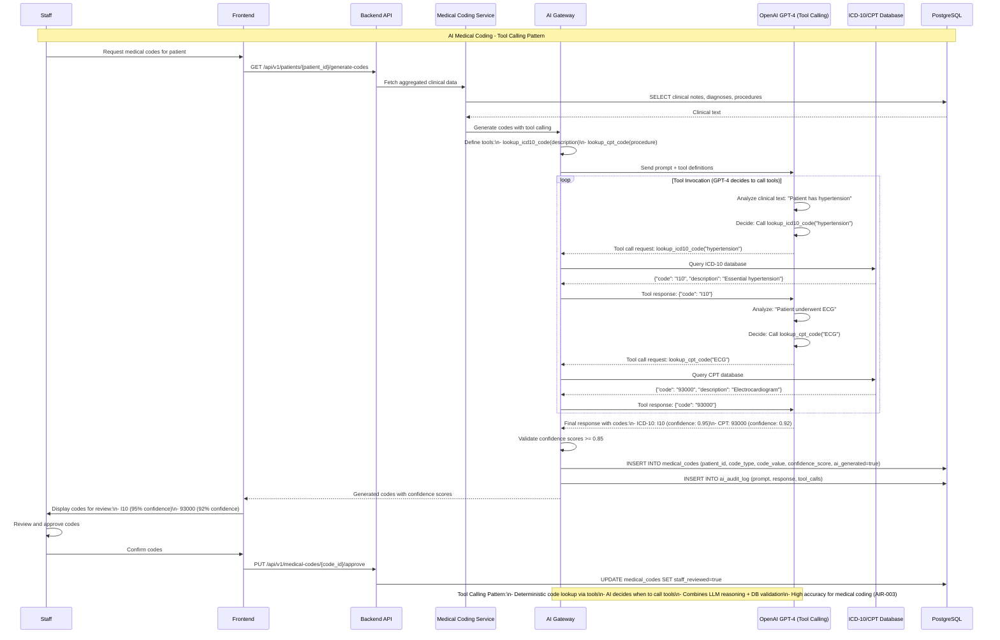
```mermaid
sequenceDiagram
    participant Staff as Staff
    participant Frontend as Frontend
    participant API as Backend API
    participant CodingService as Medical Coding Service
    participant AIGateway as AI Gateway
    participant OpenAI as OpenAI GPT-4 (Tool Calling)
    participant CodeDB as ICD-10/CPT Database
    participant DB as PostgreSQL

    Note over Staff,DB: AI Medical Coding - Tool Calling Pattern

    Staff->>Frontend: Request medical codes for patient
    Frontend->>API: GET /api/v1/patients/{patient_id}/generate-codes
    API->>CodingService: Fetch aggregated clinical data
    CodingService->>DB: SELECT clinical notes, diagnoses, procedures
    DB-->>CodingService: Clinical text

    CodingService->>AIGateway: Generate codes with tool calling
    AIGateway->>AIGateway: Define tools:\n- lookup_icd10_code(description)\n- lookup_cpt_code(procedure)
    AIGateway->>OpenAI: Send prompt + tool definitions

    loop Tool Invocation (GPT-4 decides to call tools)
        OpenAI->>OpenAI: Analyze clinical text: "Patient has hypertension"
        OpenAI->>OpenAI: Decide: Call lookup_icd10_code("hypertension")
        OpenAI-->>AIGateway: Tool call request: lookup_icd10_code("hypertension")
        AIGateway->>CodeDB: Query ICD-10 database
        CodeDB-->>AIGateway: {"code": "I10", "description": "Essential hypertension"}
        AIGateway->>OpenAI: Tool response: {"code": "I10"}

        OpenAI->>OpenAI: Analyze: "Patient underwent ECG"
        OpenAI->>OpenAI: Decide: Call lookup_cpt_code("ECG")
        OpenAI-->>AIGateway: Tool call request: lookup_cpt_code("ECG")
        AIGateway->>CodeDB: Query CPT database
        CodeDB-->>AIGateway: {"code": "93000", "description": "Electrocardiogram"}
        AIGateway->>OpenAI: Tool response: {"code": "93000"}
    end

    OpenAI-->>AIGateway: Final response with codes:\n- ICD-10: I10 (confidence: 0.95)\n- CPT: 93000 (confidence: 0.92)
    AIGateway->>AIGateway: Validate confidence scores >= 0.85
    AIGateway->>DB: INSERT INTO medical_codes (patient_id, code_type, code_value, confidence_score, ai_generated=true)
    AIGateway->>DB: INSERT INTO ai_audit_log (prompt, response, tool_calls)
    AIGateway-->>Frontend: Generated codes with confidence scores

    Frontend->>Staff: Display codes for review:\n- I10 (95% confidence)\n- 93000 (92% confidence)
    Staff->>Staff: Review and approve codes
    Staff->>Frontend: Confirm codes
    Frontend->>API: PUT /api/v1/medical-codes/{code_id}/approve
    API->>DB: UPDATE medical_codes SET staff_reviewed=true

    Note over AIGateway,OpenAI: Tool Calling Pattern:\n- Deterministic code lookup via tools\n- AI decides when to call tools\n- Combines LLM reasoning + DB validation\n- High accuracy for medical coding (AIR-003)
```
