# Unified Patient Access & Clinical Intelligence Platform
**Requirements Specification**  
**Version:** 1.0.0  
**Date:** March 15, 2026

## Change History & Revision Log

| Date & Time         | Version | Author         | Description/Change Summary                                      |
|--------------------|---------|---------------|-----------------------------------------------------------------|
| 2026-03-15  | 1.0.0   | Initial Author | Initial version, requirements, use cases, and traceability added |
| 2026-03-15  | 1.0.1   | User/AI        | Added Problem Statement, Market Strategy, Project Scope, Title   |
| 2026-03-15  | 1.0.2   | User/AI        | Grouped FE/BE features, added admin/user management, medication conflict, traceability tables, and all missing use cases |
| 2026-03-15  | 1.0.3   | User/AI        | Added bullet formatting, clarified scope, and ensured all requirements mapped |
| 2026-03-15  | 1.0.4   | User/AI        | Moved Stakeholders & Users below Project Scope; moved Assumptions/Constraints; reordered Problem Statement; renamed Feature Goal to Project Goal; updated traceability tables and added missing use cases/requirements |
| 2026-03-15  | 1.0.5   | User/AI        | Added Non-Functional Requirements section; reordered Feature Scope and Functional Requirements by process flow |
| 2026-03-15  | 1.0.6   | User/AI        | Added FR-017 and UC-011 for staff marking no-shows; updated process flow to include no-show flow; clarified that clinical staff feed ICD-10/CPT codes after document upload/intake and before visit confirmation. |
| 2026-03-15  | 1.0.7   | User/AI        | Added Technology Stack and Infrastructure sections. |
| 2026-03-15  | 1.0.8   | User/AI        | Generated and linked wireframes, UML models, test plan, project plan, epic decomposition, and traceability table for full requirements coverage. |
| 2026-03-16  | 1.0.9   | User/AI        | Project Scope refinements: added dashboards, login/authentication, appointment rescheduling, staff-assisted booking; FE Functionality: added login, dashboards, staff booking on behalf of patients; Added FR-019 (login), FR-020 (dashboards), FR-021 (staff booking); Fixed all use case titles/content (UC-001 to UC-012) and added UC-011 (Staff Mark No Show); Updated all traceability tables for complete FR-UC mapping. |
| 2026-03-17  | 1.1.0   | User/AI        | Added department management to scope, feature scope, FR-022, UC-013, and updated traceability tables. |
| 2026-03-17  | 1.1.1   | User/AI        | Updated FR-005 and UC-007 to allow staff to mark appointment status as Arrived, In Progress, and Completed. Updated scope, feature scope, stakeholders, and traceability. |
| 2026-03-17  | 1.1.2   | User/AI        | Added FR-023 and UC-014 for dashboard notifications (Admin, Staff, Patient). Updated scope, feature scope, and traceability tables. |

## Project Goal
Develop a unified healthcare platform that bridges patient appointment booking and clinical data management, providing a seamless, patient-centric experience and a "Trust-First" clinical intelligence engine.

## Problem Statement
• Disconnected data pipelines create inefficiencies across scheduling and clinical prep.
• High no-show rates due to complex booking and lack of smart reminders.
• Manual extraction of clinical data from unstructured reports wastes staff time.
• Existing solutions are fragmented, lacking integration between booking and clinical data.
• Current AI tools lack transparency and trust, requiring manual verification.

## Project Scope
• In-Scope:
  - Patients, Staff (front desk/call center), and Admin (user management) roles
  - Secure login and authentication for Admin, Staff, and Patient
  - Role-specific dashboards for Admin, Staff, and Patient with personalized views and actions
  - Role-based access control and immutable audit logging
  - AI-assisted and manual patient intake options
  - Clinical document upload and 360-degree data extraction for patient profile
  - Insurance pre-check against internal dummy records
  - Appointment booking with waitlist, automated reminders, and calendar sync (Google/Outlook via free APIs)
  - Appointment rescheduling and cancellation by Patient
  - Appointment booking by Staff on behalf of patients who arrive at the hospital in person
  - After booking, appointment details sent as PDF via email
  - Staff-controlled walk-ins, same-day queue management, and arrival marking
  - Staff appointment status tracking (mark as Arrived, In Progress, and Completed)
  - Rule-based no-show risk assessment
  - Medical coding (ICD-10, CPT) from aggregated data
  - Highlighting medication conflicts and resolve automatically by staff
  - Admin department management (create, edit, delete departments and assign patients to departments)
  - Real-time dashboard notifications for Admin, Staff, and Patient (appointment reminders, status updates, system alerts)
• Out-of-Scope:
  - Provider logins or provider-facing actions
  - Payment gateway integration (future provision only)
  - Family member profile features
  - Patient self-check-in (mobile, web portal, or QR code)
  - Direct, bi-directional EHR integration or full claims submission
  - Use of paid cloud infrastructure (e.g., Azure, AWS)

## Market Strategy
• Target healthcare providers aiming to reduce no-show rates and streamline clinical prep.
• Offer a unified, open-source, trust-first solution with both AI and manual options.
• Differentiate from fragmented competitors by integrating booking and clinical data.
• Focus on adoption by clinics/hospitals valuing cost-effective, compliance-driven tech.
• Leverage free/open-source hosting and tools to minimize costs and maximize accessibility.

## Risks & Mitigations
- Data privacy breaches – Mitigate with HIPAA compliance and audit logging
- AI extraction errors – Human review and conflict flagging
- System downtime – Use open-source, reliable hosting and session management
- User adoption resistance – Provide both AI and manual options
- Integration failures – Use only free, well-documented APIs

## Constraints & Assumptions
- No paid cloud infrastructure; only open-source/free hosting
- No provider-facing features in Phase 1
- All data handling must be HIPAA-compliant
- Only dummy insurance records used for pre-check
- No patient self-check-in allowed
- All user actions are logged immutably for audit
- System must be deployable on Windows Services/IIS and use PostgreSQL for structured data
- Upstash Redis is used for caching
- Target 99.9% uptime and 15-minute session timeout

## Stakeholders & Users

### Stakeholder List & Responsibilities
• Patients – Book appointments, upload documents, complete intake, receive reminders (Responsible)
• Staff (Front Desk/Call Center) – Manage bookings, walk-ins, queues, mark arrivals/in-progress/completed, review conflicts (Accountable)
• Admin – Manage user accounts, roles, and access (Accountable/Consulted)
• IT/Support – Maintain platform, ensure uptime, manage audit logs (Consulted/Informed)
• Compliance Officer – Ensure HIPAA compliance and audit readiness (Consulted)
• External Calendar APIs (Google/Outlook) – Calendar sync (Informed)

### User Personas / User Groups
• Patient: Tech-savvy and non-tech users, various age groups, require simple and accessible booking/intake
• Staff: Front desk, call center, clinical support, need efficient queue and conflict management
• Admin: IT or operations manager, responsible for user management and access control

### User Needs and Pain Points
• Patients: Need easy, flexible booking and intake; dislike complex forms and lack of reminders
• Staff: Need to minimize manual data entry, quickly resolve conflicts, and manage queues efficiently
• Admin: Need robust user management, audit trails, and compliance features
• All: Require secure, reliable, and user-friendly platform with minimal downtime

## Business Justification
- Reduces no-show rates and increases schedule utilization by simplifying booking and automating reminders.
- Eliminates manual data extraction, saving staff time and reducing errors.
- Fills a market gap for integrated, open-source, and trustworthy healthcare solutions.
- Improves operational efficiency and clinical accuracy for patients, staff, and administrators.

## Feature Scope
- **Frontend (FE) Functionality:**
   
  - Secure login and authentication for Admin, Staff, and Patient
  - Role-specific dashboards for Admin, Staff, and Patient with personalized views and actions
  - Intuitive appointment booking
  - Dynamic preferred slot swap
  - Waitlist handling
  - Insurance pre-check against internal dummy records
  - AI-assisted and manual patient intake options (switchable at any time)
  - Appointment booking by Staff on behalf of patients who arrive at the hospital in person
  - Staff-controlled walk-in bookings
  - Same-day queue management and arrival marking
  - Appointment status progression by Staff (Arrived → In Progress → Completed)
  - Staff Marks as No show if no show of patient occurs
  - Rule based no show risk assessment
  - Automated multi-channel reminders (SMS/Email) and calendar sync (Google/Outlook via free APIs)
  - After booking, send appointment details as a PDF in Email
  - Upload and extraction of clinical documents to build a unified, de-duplicated patient profile
  - Medical coding (ICD-10, CPT) from aggregated data
  - Highlight conflict in medications
  - Admin user management (create, update, deactivate users and assign roles)
  - Admin department management (create, edit, delete departments and assign patients to departments)
  - Real-time dashboard notifications for Admin, Staff, and Patient (appointment reminders, status updates, conflict alerts, system alerts)

- **Backend (BE) Functionality:**
  - Insurance pre-check against internal dummy records
  - Rule based no show risk assessment
  - Upload and extraction of clinical documents to build a unified, de-duplicated patient profile
  - Medical coding (ICD-10, CPT) from aggregated data
  - Highlight conflict in medications
  - Role-based access control
  - Immutable audit logging
  - Department management (CRUD operations and patient-department assignment)
  - Rule based no show risk assessment
  - Highlight conflict in medications

### Success Criteria
- [ ] No-show rate reduced by at least 5% from baseline.
- [ ] Staff time per appointment reduced by 10+ minutes.
- [ ] >98% AI-Human agreement rate for clinical data/coding.
- [ ] 99.9% uptime and session reliability.
- [ ] All patient and staff actions logged immutably.

## Technology Stack
| Layer      | Technology                | Version | Justification (NFR/DR/AIR)         |
|------------|---------------------------|---------|------------------------------------|
| Frontend   | React (or Angular/Vue)    | latest  | NFR-001, NFR-004                   |
| Backend    | Node.js (Express)         | latest  | NFR-003, NFR-004                   |
| Database   | PostgreSQL                | latest  | DR-001, DR-002, DR-003             |
| Caching    | Upstash Redis             | latest  | NFR-004                            |
| AI/ML      | OpenAI API                | latest  | AIR-001, AIR-002, AIR-003, AIR-004 |
| Testing    | Jest / Mocha              | latest  | NFR-004                            |
| Infrastructure | Netlify/Vercel/GitHub Codespaces | latest | NFR-003, NFR-004         |
| Security   | OAuth2, HTTPS, JWT        | latest  | NFR-001, NFR-002                   |
| Deployment | Windows Services/IIS      | latest  | NFR-003                            |
| Monitoring | Prometheus/Grafana        | latest  | NFR-004                            |
| Documentation | Markdown, PlantUML     | latest  | NFR-001                            |

## Infrastructure
- Open-source and free hosting only (Netlify, Vercel, GitHub Codespaces)
- Native deployment on Windows Services/IIS
- PostgreSQL for structured data storage
- Upstash Redis for caching
- Automated monitoring with Prometheus/Grafana
- Secure APIs with OAuth2/JWT and HTTPS
- Immutable audit logging for all user actions
- No paid cloud infrastructure (AWS, Azure, etc.)

## Functional Requirements
- FR-001: System MUST allow patients to book, reschedule, and cancel appointments via web UI.
- FR-002: System MUST provide dynamic preferred slot swap and waitlist management.
- FR-003: System MUST send automated reminders via SMS/Email and support calendar sync. [DETERMINISTIC]
- FR-004: System MUST allow patients to choose between AI-assisted conversational intake and manual forms, switchable at any time. [AI-CANDIDATE]
- FR-005: System MUST allow staff to manage walk-ins, same-day queues, mark arrivals, and update appointment status to In Progress and Completed.
- FR-006: System MUST ingest and extract structured data from uploaded clinical documents. [AI-CANDIDATE]
- FR-007: System MUST generate a unified, de-duplicated patient profile and highlight data conflicts. [HYBRID]
- FR-008: System MUST map ICD-10 and CPT codes from aggregated data. [AI-CANDIDATE]
- FR-009: System MUST perform insurance pre-check against internal dummy records. [DETERMINISTIC]
- FR-010: System MUST enforce strict role-based access control and immutable audit logging. [DETERMINISTIC]
- FR-011: System MUST provide PDF appointment confirmation via email.
- FR-012: After booking, system MUST send appointment details as a PDF in Email to the patient. [DETERMINISTIC]
- FR-013: System MUST NOT allow patient self-check-in via app, web, or QR code. [DETERMINISTIC]
- FR-014: System MUST perform rule based no show risk assessment for all appointments and flag high-risk bookings to staff. [DETERMINISTIC]
- FR-015: System MUST provide an Admin Operations interface for user management (create, update, deactivate users, assign roles) via the frontend UI. [DETERMINISTIC]
 - FR-016: System MUST detect and highlight conflicts in patient medications within the unified patient profile and alert staff for review. [HYBRID]
 - FR-017: System MUST allow staff to mark an appointment as 'No Show' if the patient does not arrive, and log this action immutably for audit and future risk assessment. [DETERMINISTIC]
 - FR-018: System MUST provide each patient with a secure dashboard to view appointments, upload documents, complete intake, and receive notifications. [DETERMINISTIC]
 - FR-019: System MUST provide secure login and authentication for Admin, Staff, and Patient with appropriate session management. [DETERMINISTIC]
 - FR-020: System MUST provide role-specific dashboards for Admin, Staff, and Patient with personalized views, actions, and data relevant to each role. [DETERMINISTIC]
 - FR-021: System MUST allow Staff to book appointments on behalf of patients who arrive at the hospital in person. [DETERMINISTIC]
 - FR-022: System MUST allow Admin to create, edit, and delete departments, and assign patients to departments. Department selection MUST be available only for the Patient role during user creation and registration. [DETERMINISTIC]
 - FR-023: System MUST provide real-time dashboard notifications for Admin, Staff, and Patient roles. Notifications MUST include appointment reminders (24 hours before), appointment status updates (booked, rescheduled, cancelled, arrived, in progress, completed, no-show), medication conflict alerts, insurance pre-check failures, waitlist slot availability, and system alerts. Notifications MUST be dismissible and display a notification count badge. [DETERMINISTIC]


## Non-Functional Requirements
- The platform must be 100% HIPAA-compliant in data handling, transmission, and storage.
- Strict role-based access control and immutable audit logging for all patient and staff actions.
- Native deployment capabilities (Windows Services/IIS) using PostgreSQL for structured data and Upstash Redis for caching.
- Target 99.9% uptime with robust session management (15-minute automatic timeout).
- All user actions must be logged immutably for audit and compliance.
- The system must be hosted on free, open-source-friendly platforms (e.g., Netlify, Vercel, GitHub Codespaces).
- No use of paid cloud infrastructure (e.g., AWS, Azure) in this phase.
- Automated multi-channel reminders must be delivered reliably and on schedule.
- The platform must support high volume of patient dashboards and appointments without performance degradation.
- All APIs and integrations must use secure, standards-based protocols (e.g., HTTPS, OAuth where applicable).
- The system must provide clear error messages and support graceful failure handling.
- All sensitive data must be encrypted at rest and in transit.

## Use Case Analysis

### Actors & System Boundary
- Primary Actor: Patient – books appointments, uploads documents, receives reminders.
- Secondary Actor: Staff – manages bookings, walk-ins, queues, and marks arrivals.
- System Actor: Admin – manages user roles and access; External: Calendar APIs (Google/Outlook).

### Use Case Specifications
#### UC-001: Appointment Booking
- **Actor(s)**: Patient
- **Goal**: Secure an appointment slot with preferred options
- **Preconditions**: Patient has access to platform
- **Success Scenario**:
  1. Patient logs in or registers
  2. Selects appointment type and preferred slot
  3. Books available slot or joins waitlist for preferred slot
  4. Receives confirmation and reminders
- **Extensions/Alternatives**:
  - 3a. If preferred slot opens, system auto-swaps and notifies patient
  - 4a. Patient cancels or reschedules
- **Postconditions**: Appointment is booked and confirmed

##### Use Case Diagram
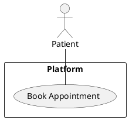

#### UC-002: Patient Intake
- **Actor(s)**: Patient
- **Goal**: Complete intake via AI or manual form
- **Preconditions**: Appointment booked
- **Success Scenario**:
  1. Patient chooses intake method (AI/manual)
  2. Completes and submits intake
  3. System processes and confirms
- **Extensions/Alternatives**:
  - 1a. Patient switches intake method mid-process
- **Postconditions**: Intake data is stored and available for staff

##### Use Case Diagram
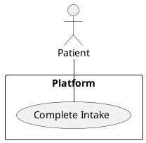

#### UC-003: Clinical Data Aggregation
- **Actor(s)**: Staff
- **Goal**: Aggregate and verify patient clinical data
- **Preconditions**: Patient uploaded documents
- **Success Scenario**:
  1. Staff accesses patient profile
  2. System extracts and consolidates data
  3. Staff reviews, resolves conflicts, and confirms
- **Extensions/Alternatives**:
  - 3a. System flags critical data conflicts
- **Postconditions**: Verified, unified patient profile ready for visit

##### Use Case Diagram
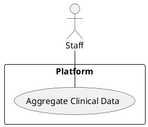

#### UC-004: Send Appointment Details as PDF
- **Actor(s)**: System, Patient
- **Goal**: Ensure patient receives appointment details as a PDF via email after booking
- **Preconditions**: Appointment is successfully booked
- **Success Scenario**:
  1. Patient completes appointment booking
  2. System generates a PDF with appointment details
  3. System sends the PDF as an email attachment to the patient
  4. Patient receives and can access the PDF
- **Extensions/Alternatives**:
  - 3a. If email delivery fails, system retries and/or notifies support
- **Postconditions**: Patient has received appointment details as a PDF in their email

##### Use Case Diagram
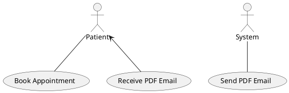

#### UC-005: Rule Based No Show Risk Assessment
- **Actor(s)**: System, Staff
- **Goal**: Assess and flag high-risk no-show appointments using rule-based logic
- **Preconditions**: Appointment is created or updated
- **Success Scenario**:
  1. Patient books or updates an appointment
  2. System evaluates appointment details using rule-based criteria
  3. If risk is high, system flags the appointment and notifies staff
  4. Staff reviews flagged appointments and takes appropriate action
- **Extensions/Alternatives**:
  - 3a. If risk cannot be determined, system logs for manual review
- **Postconditions**: High-risk appointments are flagged and visible to staff

##### Use Case Diagram
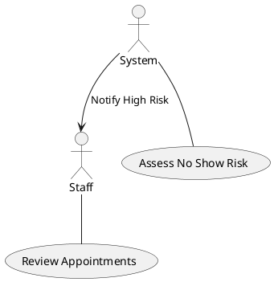

#### UC-006: Admin User Management
- **Actor(s)**: Admin
- **Goal**: Manage user accounts and roles through the Admin Operations interface
- **Preconditions**: Admin is authenticated and authorized
- **Success Scenario**:
  1. Admin accesses the Admin Operations interface
  2. Admin creates, updates, deactivates users, or assigns roles as needed
  3. System validates and applies changes
  4. Confirmation is shown to the admin
- **Extensions/Alternatives**:
  - 3a. If validation fails, system displays error and does not apply changes
- **Postconditions**: User accounts and roles are updated as per admin actions

##### Use Case Diagram
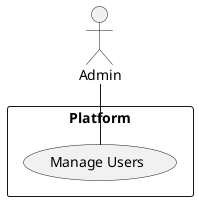

#### UC-007: Staff Walk-in and Queue Management
- **Actor(s)**: Staff
- **Goal**: Manage walk-in patients and same-day queue
- **Preconditions**: Staff is authenticated and authorized
- **Success Scenario**:
  1. Staff accesses the queue management interface
  2. Staff adds walk-in patients or manages same-day queue
  3. Staff marks patients as "Arrived" upon arrival
  4. System updates queue and notifies relevant parties
- **Extensions/Alternatives**:
  - 2a. If queue is full, system displays warning
- **Postconditions**: Walk-in and queued patients are managed and tracked

##### Use Case Diagram
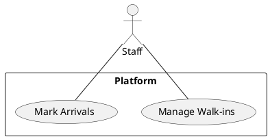

#### UC-008: Role-Based Access Control and Audit Logging
- **Actor(s)**: Admin, Staff, Patient
- **Goal**: Enforce access permissions and log all actions
- **Preconditions**: User is authenticated
- **Success Scenario**:
  1. User attempts to access a feature
  2. System checks user role and permissions
  3. If permitted, access is granted and action is logged
  4. If not permitted, access is denied and attempt is logged
- **Extensions/Alternatives**:
  - 3a. If audit log storage fails, system retries and alerts admin
- **Postconditions**: All actions are logged and access is controlled per role

##### Use Case Diagram
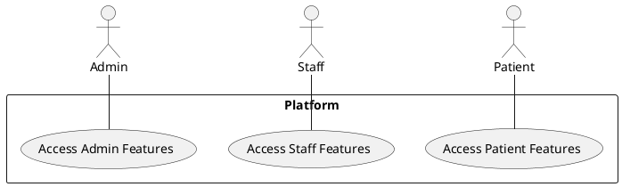

#### UC-009: Restrict Patient Self-Check-In
- **Actor(s)**: Patient
- **Goal**: Prevent patients from self-checking in via app, web, or QR code
- **Preconditions**: Patient attempts to check in
- **Success Scenario**:
  1. Patient attempts self-check-in
  2. System blocks the action and displays a message
- **Extensions/Alternatives**:
  - 2a. If patient persists, system logs repeated attempts
- **Postconditions**: No patient self-check-in is allowed

##### Use Case Diagram
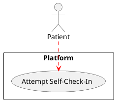

#### UC-010: Highlight Medication Conflicts
- **Actor(s)**: Staff, System
- **Goal**: Detect and highlight conflicts in patient medications
- **Preconditions**: Patient clinical data is aggregated
- **Success Scenario**:
  1. System analyzes aggregated medication data
  2. System detects potential conflicts
  3. System highlights conflicts in the patient profile
  4. Staff reviews and resolves conflicts
- **Extensions/Alternatives**:
  - 2a. If conflict detection fails, system logs for manual review
- **Postconditions**: Medication conflicts are visible and actionable for staff

##### Use Case Diagram
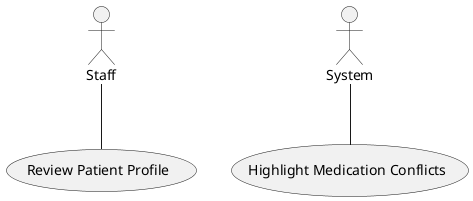

#### UC-011: Staff Mark No Show
- **Actor(s)**: Staff
- **Goal**: Mark an appointment as No Show when patient does not arrive
- **Preconditions**: Appointment exists and arrival time has passed
- **Success Scenario**:
  1. Staff accesses appointment list or patient record
  2. Staff identifies patient who did not arrive
  3. Staff marks appointment as "No Show"
  4. System logs the action immutably for audit
  5. System updates no-show risk assessment data
  6. Confirmation is displayed to staff
- **Extensions/Alternatives**:
  - 3a. If grace period not elapsed, system displays warning
  - 4a. If audit logging fails, system retries and alerts admin
- **Postconditions**: Appointment marked as no-show, action logged, risk data updated

##### Use Case Diagram
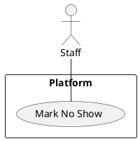

#### UC-012: Patient Dashboard Access
- **Actor(s)**: Patient
- **Goal**: Access a secure dashboard to manage appointments, upload documents, complete intake, and receive notifications
- **Preconditions**: Patient is authenticated
- **Success Scenario**:
  1. Patient logs into the platform
  2. Patient accesses the dashboard
  3. Patient views upcoming and past appointments
  4. Patient uploads clinical documents
  5. Patient completes intake forms
  6. Patient receives and reviews notifications/reminders
- **Extensions/Alternatives**:
  - 2a. If authentication fails, access is denied
- **Postconditions**: Patient can manage all relevant activities from the dashboard

##### Use Case Diagram
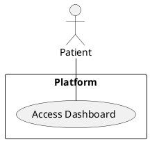


@enduml
```

#### UC-013: Admin Department Management
- **Actor(s)**: Admin
- **Goal**: Create, edit, and delete departments and assign patients to departments
- **Preconditions**: Admin is authenticated and authorized
- **Success Scenario**:
  1. Admin navigates to Department Management from the sidebar
  2. Admin views the list of existing departments with status and patient count
  3. Admin creates a new department by providing name and description
  4. System validates and saves the department
  5. Admin edits an existing department's name or description
  6. Admin deletes a department that has no assigned patients
  7. System updates all department references accordingly
- **Extensions/Alternatives**:
  - 4a. If department name already exists, system displays a duplicate error
  - 6a. If department has assigned patients, system blocks deletion and displays a warning
- **Postconditions**: Departments are created, updated, or deleted; patients can be assigned to active departments during user creation/registration

##### Use Case Diagram
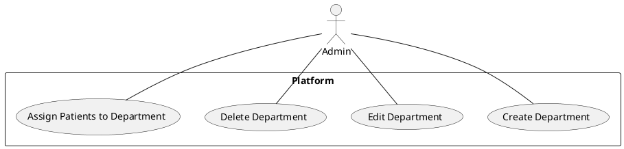

#### UC-014: Dashboard Notifications
- **Actor(s)**: Admin, Staff, Patient
- **Goal**: Receive and manage real-time notifications on the dashboard for appointment updates, system alerts, and clinical alerts
- **Preconditions**: User is authenticated and viewing their role-specific dashboard
- **Success Scenario**:
  1. System detects an event requiring notification (appointment status change, medication conflict, waitlist slot available, insurance pre-check failure, system alert)
  2. System generates notification with appropriate priority (Info, Warning, Critical)
  3. Dashboard displays notification popup with icon, title, message, and timestamp
  4. Notification badge count updates in header navigation
  5. User clicks notification to view details or take action
  6. User dismisses notification by clicking the close icon
  7. System marks notification as read and decrements badge count
- **Extensions/Alternatives**:
  - 5a. User clicks "View All Notifications" to see notification history panel
  - 6a. User clicks "Dismiss All" to clear all read notifications
  - Critical notifications (medication conflicts, insurance failures) remain until explicitly dismissed by user
- **Postconditions**: User is informed of important events in real-time; notifications are logged for audit

##### Use Case Diagram
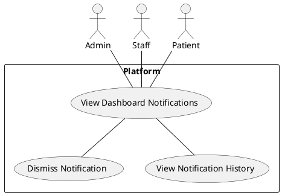

### Feature Scope to Functional Requirement Traceability Table

| Feature Scope Point                                                                 | Functional Requirement(s) |
|-------------------------------------------------------------------------------------|---------------------------|
| Secure login and authentication for Admin, Staff, and Patient                       | FR-019                    |
| Role-specific dashboards for Admin, Staff, and Patient with personalized views and actions | FR-020                    |
| Intuitive appointment booking with dynamic preferred slot swap and waitlist         | FR-001, FR-002            |
| AI-assisted and manual patient intake options, switchable at any time               | FR-004                    |
| Appointment booking by Staff on behalf of patients who arrive at the hospital in person | FR-021                    |
| Automated multi-channel reminders (SMS/Email) and calendar sync                     | FR-003                    |
| After booking, send appointment details as a PDF in Email                           | FR-011, FR-012            |
| Staff-controlled walk-in bookings, same-day queue management, arrival and status tracking (Arrived/In Progress/Completed) | FR-005                    |
| Staff marks as No Show if patient does not arrive                                   | FR-017                    |
| Admin user management (create, update, deactivate users and assign roles)           | FR-015                    |
| Admin department management (create, edit, delete departments and assign patients)   | FR-022                    |
| Upload and extraction of clinical documents to build a unified, de-duplicated profile| FR-006, FR-007            |
| Medical coding (ICD-10, CPT) from aggregated data                                   | FR-008                    |
| Insurance pre-check against internal dummy records                                  | FR-009                    |
| Role-based access control and immutable audit logging                               | FR-010                    |
| Rule based no show risk assessment                                                  | FR-014                    |
| Highlight conflict in medications                                                   | FR-016                    |


### Functional Requirement to Use Case Traceability Table

| Functional Requirement                                                                 | Use Case(s)         |
|----------------------------------------------------------------------------------------|---------------------|
| FR-001: System MUST allow patients to book, reschedule, and cancel appointments        | UC-001              |
| FR-002: System MUST provide dynamic preferred slot swap and waitlist management        | UC-001              |
| FR-003: System MUST send automated reminders via SMS/Email and support calendar sync   | UC-001              |
| FR-004: System MUST allow patients to choose between AI-assisted conversational intake | UC-002              |
| FR-005: System MUST allow staff to manage walk-ins, same-day queues, mark arrivals, and update appointment status to In Progress and Completed | UC-007              |
| FR-006: System MUST ingest and extract structured data from uploaded clinical documents| UC-003              |
| FR-007: System MUST generate a unified, de-duplicated patient profile and highlight data conflicts | UC-003, UC-010 |
| FR-008: System MUST map ICD-10 and CPT codes from aggregated data                      | UC-003              |
| FR-009: System MUST perform insurance pre-check against internal dummy records         | UC-003              |
| FR-010: System MUST enforce strict role-based access control and immutable audit logging| UC-008              |
| FR-011: System MUST provide PDF appointment confirmation via email                     | UC-004              |
| FR-012: After booking, system MUST send appointment details as a PDF in Email          | UC-004              |
| FR-013: System MUST NOT allow patient self-check-in via app, web, or QR code           | UC-009              |
| FR-014: System MUST perform rule based no show risk assessment for all appointments    | UC-005              |
| FR-015: System MUST provide an Admin Operations interface for user management          | UC-006              |
| FR-016: System MUST detect and highlight conflicts in patient medications              | UC-010              |
| FR-017: System MUST allow staff to mark an appointment as 'No Show' if the patient does not arrive, and log this action immutably for audit and future risk assessment | UC-011 |
| FR-018: System MUST provide each patient with a secure dashboard to view appointments, upload documents, complete intake, and receive notifications | UC-012 |
| FR-019: System MUST provide secure login and authentication for Admin, Staff, and Patient with appropriate session management | UC-008 |
| FR-020: System MUST provide role-specific dashboards for Admin, Staff, and Patient with personalized views, actions, and data relevant to each role | UC-012 |
| FR-021: System MUST allow Staff to book appointments on behalf of patients who arrive at the hospital in person | UC-001, UC-007 |
| FR-022: System MUST allow Admin to create, edit, and delete departments, and assign patients to departments | UC-013 |
| FR-023: System MUST provide real-time dashboard notifications for Admin, Staff, and Patient roles with notification badge count and dismissible popups | UC-014 |

# Appendices

## Glossary
- **ICD-10**: International Classification of Diseases, 10th Revision
- **CPT**: Current Procedural Terminology
- **No Show**: A patient who does not arrive for a scheduled appointment
- **Waitlist**: A list of patients waiting for an earlier or preferred appointment slot
- **Audit Logging**: Immutable recording of user/system actions for compliance
- **Patient Dashboard**: Secure portal for patients to manage appointments, documents, intake, and notifications

## Open Questions
- [ ] Are there any regulatory requirements beyond HIPAA to consider?
- [ ] Should patients be able to view historical no-show records?
- [ ] What is the grace period for marking a no-show?
- [ ] Who is responsible for resolving data conflicts flagged by the system?

## Future Enhancements / Backlog
- Patient self-check-in via mobile/web/QR (future phase)
- Provider-facing features and logins
- Payment gateway integration
- Family member profile management
- Direct EHR integration and claims submission
- Advanced analytics and reporting
- Patient feedback and satisfaction surveys

## References
- [ICD-10 Overview - CDC](https://www.cdc.gov/nchs/icd/icd10cm.htm)
- [CPT Codes - AMA](https://www.ama-assn.org/practice-management/cpt)
- [HIPAA Compliance](https://www.hhs.gov/hipaa/index.html)


@startuml
!define RECTANGLE(x) rectangle "x" as x

' Actors
actor Patient
actor Staff
actor Admin
actor System

' Patient Appointment Booking Options
Patient --> (AI Conversational Booking)
Patient --> (Manual Form Booking)
Patient --> (Assisted Booking at Hospital)

' Booking Flows
(AI Conversational Booking) --> (Book Appointment)
(Manual Form Booking) --> (Book Appointment)
(Assisted Booking at Hospital) --> Staff
Staff --> (Book Appointment)

' Document Upload
Patient --> (Upload Documents)
(Upload Documents) --> (Aggregate Clinical Data)

' Insurance Precheck
(Book Appointment) --> (Insurance Precheck)
(Insurance Precheck) --> (Confirm Booking)

' Slot Management
(Book Appointment) --> (Slot Allocation)
(Slot Allocation) --> (Slot Swap)
(Slot Swap) --> (Create New Slot)
(Create New Slot) --> (Slot Allocation)

' PDF Confirmation
(Confirm Booking) --> (Generate PDF Confirmation)
(Generate PDF Confirmation) --> Patient
(Generate PDF Confirmation) --> (Send Email Notification)

' Notifications
(Confirm Booking) --> (Send Notification)
(Send Notification) --> Patient
(Send Notification) --> Staff

' Queue & Walk-in Management
Staff --> (Queue Management)
Staff --> (Walk-in Management)
(Queue Management) --> (Mark Arrival)
(Walk-in Management) --> (Mark Arrival)
(Mark Arrival) --> (Update Queue)

' No Show & Cancellation
Staff --> (Mark No Show)
(Mark No Show) --> (Update Queue)
Patient --> (Cancel Appointment)
(Cancel Appointment) --> (Slot Allocation)

' Only Staff can mark arrival/no show
' (already shown above)

' Admin User Management
Admin --> (User Management)
(User Management) --> (Create User)
(User Management) --> (Update User)
(User Management) --> (Deactivate User)
(User Management) --> (Assign Roles)

' Medical Coding & Conflict
(Aggregate Clinical Data) --> (Medical Coding: ICD-10/CPT)
(Aggregate Clinical Data) --> (Highlight Medication Conflict)

@enduml
